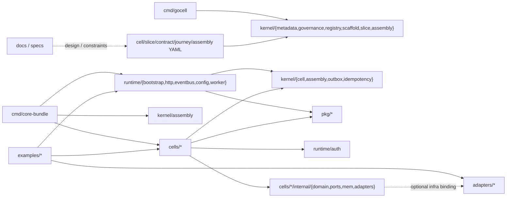
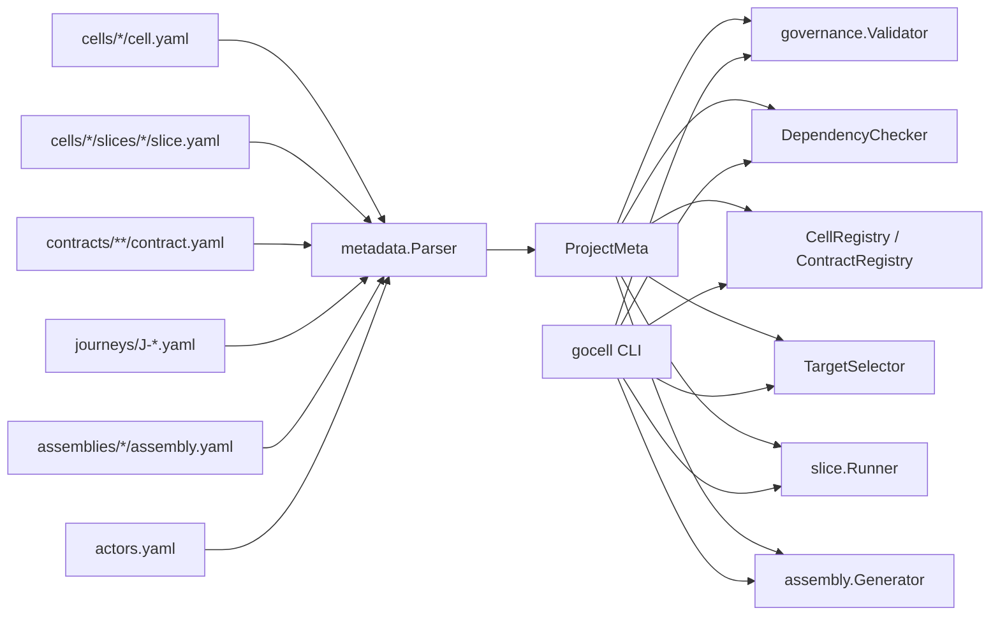
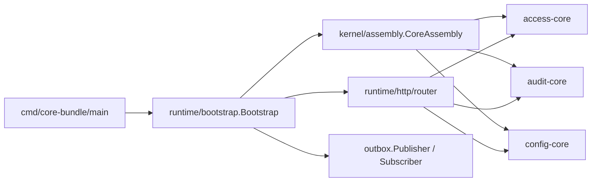

# GoCell 模块依赖与关系图报告

更新时间: 2026-04-06

## 1. 结论摘要

GoCell 当前不是单一业务应用，而是一个以 Cell/Slice 架构为核心的 Go 工程底座，包含:

- `pkg/` 公共工具层
- `kernel/` 架构内核与治理工具链
- `runtime/` 运行时编排与 HTTP/事件基础设施
- `adapters/` 外部基础设施适配层
- `cells/` 业务能力模块
- `contracts/`、`journeys/`、`assemblies/`、`actors.yaml` 元数据真相层
- `cmd/` 工具与装配入口
- `examples/` 示例工程

从当前代码树静态统计看，仓库实际包含:

- 6 个 Cell
- 21 个 Slice
- 18 个 Contract
- 9 个 Journey
- 1 个 Assembly

说明: 本报告基于源码和 metadata 静态分析整理。由于当前环境的 Go module cache 受沙箱限制，`go test` 和 `go run` 未做完整运行时验证。

## 2. 总体分层



### 2.1 最低层: `pkg/`

提供共享基础能力:

- `errcode`
- `ctxkeys`
- `httputil`
- `id`
- `uid`

这是全仓库的最底层工具依赖。

### 2.2 架构内核: `kernel/`

核心职责:

- 定义 `Cell / Slice / Contract / Assembly` 抽象
- 承载 metadata parser、schema、registry、governance
- 提供 scaffold / verify / generate 等工具链

关键入口:

- `src/kernel/cell/interfaces.go`
- `src/kernel/cell/base.go`
- `src/kernel/metadata/parser.go`
- `src/kernel/governance/validate.go`
- `src/kernel/assembly/assembly.go`

### 2.3 运行时: `runtime/`

核心职责:

- 启动编排: `bootstrap`
- HTTP: `router`、`health`、`middleware`
- 认证: `auth`
- 配置: `config`
- 事件: `eventbus`
- 任务与关闭: `worker`、`shutdown`
- 可观测性: `logging`、`metrics`、`tracing`

### 2.4 适配层: `adapters/`

当前已实现:

- `postgres`
- `redis`
- `rabbitmq`
- `oidc`
- `s3`
- `websocket`

这些模块原则上应被 runtime 或 cell 内部 adapter 使用，而不是直接渗透业务 domain。

### 2.5 业务模块: `cells/`

当前代码树中的 Cell:

- `access-core`
- `audit-core`
- `config-core`
- `order-cell`
- `device-cell`
- `demo`

其中正式装配到 `core-bundle` 的只有:

- `access-core`
- `audit-core`
- `config-core`

## 3. 元数据与工具链关系



这一层说明项目是明显的 metadata-first 设计:

- 元数据先进入 `ProjectMeta`
- 再被 `validate/check/verify/generate` 消费
- CLI `gocell` 是这条链路的用户界面

## 4. 运行时装配关系



运行时调用主链:

1. `cmd/core-bundle/main` 创建 event bus、Cell 实例和 Assembly
2. `bootstrap` 负责配置加载、`StartWithConfig`、HTTP server 和订阅注册
3. `Assembly` 统一启动/停止 Cell
4. 支持 HTTP 的 Cell 注册路由
5. 支持事件的 Cell 注册订阅

## 5. HTTP 与事件调用链


仓库内主流对象组织方式是:

- `domain`: 核心对象
- `ports`: 依赖抽象
- `mem`: 内存实现
- `internal/adapters`: Cell 自有基础设施实现
- `slices/service.go`: 业务逻辑
- `slices/handler.go`: HTTP 入站适配

## 6. 三大核心 Cell 关系

```mermaid
flowchart LR
  subgraph AccessCore
    login["session-login"]
    refresh["session-refresh"]
    logout["session-logout"]
    identity["identity-manage"]
    validate["session-validate"]
    authz["authorization-decide"]
    rbac["rbac-check"]
  end

  subgraph ConfigCore
    read["config-read"]
    write["config-write"]
    publish["config-publish"]
    subscribe["config-subscribe"]
    flag["feature-flag"]
  end

  subgraph AuditCore
    append["audit-append"]
    verify["audit-verify"]
    query["audit-query"]
    archive["audit-archive"]
  end

  identity -->|event.user.created / user.locked| append
  login -->|event.session.created| append
  logout -->|event.session.revoked| append
  write -->|event.config.changed| append
  publish -->|event.config.changed / rollback| append
  write -->|event.config.changed| subscribe
  publish -->|event.config.changed| subscribe
  login -. metadata says call http.config.get .-> read
```

### 6.1 `access-core`

主要职责:

- 用户身份管理
- 会话登录/刷新/登出
- Token 校验
- 授权决策
- RBAC 查询

主要对象:

- `User`
- `Session`
- `Role`
- `Permission`

主要事件:

- `event.session.created.v1`
- `event.session.revoked.v1`
- `event.user.created.v1`
- `event.user.locked.v1`

### 6.2 `audit-core`

主要职责:

- 消费关键事件
- 生成审计记录
- 建立 hash chain
- 提供审计查询
- 完整性验证

主要对象:

- `AuditEntry`
- `HashChain`

主要事件:

- 订阅 `session.* / user.* / config.*`
- 发布 `event.audit.appended.v1`
- 发布 `event.audit.integrity-verified.v1`

### 6.3 `config-core`

主要职责:

- 配置 CRUD
- 配置发布与回滚
- 热更新缓存
- Feature Flag 查询与评估

主要对象:

- `ConfigEntry`
- `ConfigVersion`
- `FeatureFlag`

主要事件:

- `event.config.changed.v1`
- `event.config.rollback.v1`

## 7. 全模块清单

### 7.1 `cmd/`

- `cmd/gocell`
  - `validate`
  - `scaffold`
  - `generate`
  - `check`
  - `verify`
- `cmd/core-bundle`

### 7.2 `kernel/`

- `cell`
- `assembly`
- `metadata`
- `governance`
- `registry`
- `journey`
- `scaffold`
- `slice`
- `outbox`
- `idempotency`

### 7.3 `runtime/`

- `auth`
- `bootstrap`
- `config`
- `eventbus`
- `http/health`
- `http/router`
- `http/middleware`
- `observability/logging`
- `observability/metrics`
- `observability/tracing`
- `shutdown`
- `worker`

### 7.4 `adapters/`

- `postgres`
- `redis`
- `rabbitmq`
- `oidc`
- `s3`
- `websocket`

### 7.5 `cells/`

- `access-core` 7 slices
- `audit-core` 4 slices
- `config-core` 5 slices
- `order-cell` 2 slices
- `device-cell` 3 slices
- `demo` 0 slices

## 8. 当前关键漂移点

### 8.1 metadata 与实现不一致

已确认的主要漂移:

- 文档统计仍写 `3 Cell / 16 slices / 13 contracts / 8 journeys`
  - 当前代码实际是 `6 / 21 / 18 / 9`
- `access-core`
  - metadata 声明 `session-login` 会调用 `http.config.get.v1`
  - 代码里没有对应 config client
- `access-core`
  - metadata 把它放进 `config.changed / config.rollback` 订阅方
  - 代码中的 `RegisterSubscriptions` 是 no-op
- `access-core`
  - 实际暴露 `/users/*`、`/roles/*`、`/sessions/{id}`
  - contract metadata 没完整覆盖
- `audit-core`
  - `audit-query` 暴露 HTTP API
  - 但没有对应 HTTP Contract
- `config-core`
  - 暴露了写、发布、回滚 API
  - contract metadata 只覆盖 `get` 和 `flags`

### 8.2 运行时装配已落后

`core-bundle` 当前装配代码存在明显老化:

- 没给 `access-core / config-core / audit-core` 注入 `outboxWriter`

注: `WithSigningKey` 已在 PR#83 中删除，core-bundle 改为注入 `WithJWTIssuer` + `WithJWTVerifier`。
dev 模式使用临时密钥对，real 模式通过 `auth.LoadKeySetFromEnv()` 从环境变量加载稳定密钥。

### 8.3 回滚链路不完整

`config-publish.Rollback()` 只发布 `event.config.rollback.v1`，但 `config-subscribe` 只监听 `event.config.changed.v1`，所以 config-core 自己的本地 cache 不会自动随 rollback 更新。

## 9. 建议的后续动作

优先建议顺序:

1. 修 `core-bundle` 装配链，保证核心入口能按当前 Cell 要求启动
2. 补 `access-core` 与 `config-core` 的 metadata/contract 漂移
3. 补 `audit-query` 的 HTTP contract
4. 校正 `config rollback -> subscribe cache` 链路
5. 再统一刷新文档统计与架构说明

## 10. 参考入口

建议从这些文件继续阅读:

- `src/cmd/core-bundle/main.go`
- `src/runtime/bootstrap/bootstrap.go`
- `src/kernel/assembly/assembly.go`
- `src/kernel/cell/interfaces.go`
- `src/cells/access-core/cell.go`
- `src/cells/audit-core/cell.go`
- `src/cells/config-core/cell.go`
- `src/contracts/**/contract.yaml`
- `src/journeys/J-*.yaml`
