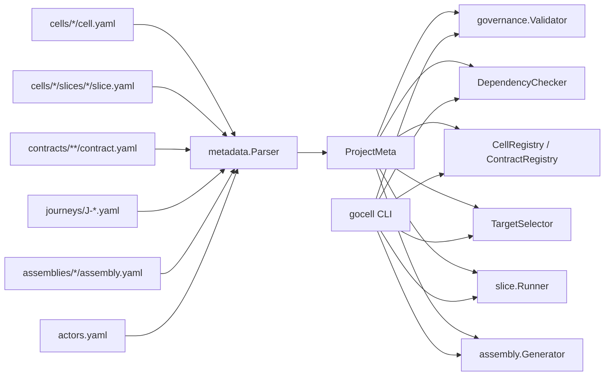
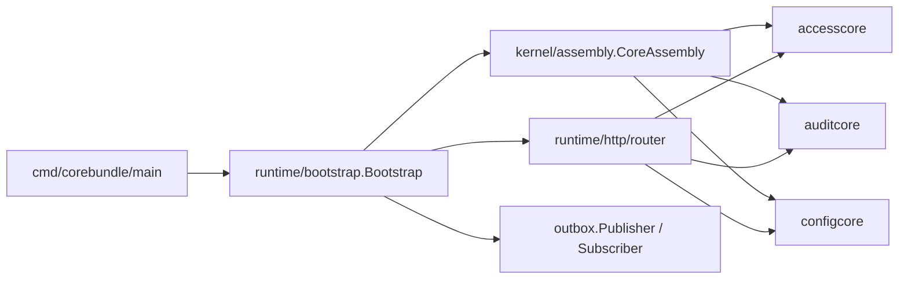
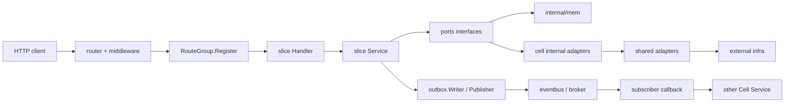

# GoCell 模块依赖与关系图报告

更新时间: 2026-04-24

## 1. 结论摘要

GoCell 当前不是单一业务应用，而是一个以 Cell/Slice 架构为核心的 Go 工程底座，包含:

- `pkg/` 公共工具层
- `kernel/` 架构内核与治理工具链
- `runtime/` 运行时编排与 HTTP/事件基础设施
- `adapters/` 外部基础设施适配层
- `cells/` 业务能力模块
- `contracts/`、`journeys/`、`assemblies/`、`actors.yaml` 元数据真相层
- `cmd/` 工具与装配入口
- `examples/` 示例工程

从当前代码树静态统计看，仓库实际包含:

- 6 个 Cell
- 29 个 Slice（22 platform + 7 examples）
- 66 个 active Contract（47 platform + 19 examples）
- 9 个 Journey
- 1 个 Assembly

说明: 本报告基于源码和 metadata 静态分析整理。由于当前环境的 Go module cache 受沙箱限制，`go test` 和 `go run` 未做完整运行时验证。

## 2. 总体分层


### 2.1 最低层: `pkg/`

提供共享基础能力:

- `errcode`
- `ctxkeys`
- `httputil`
- `id`
- `uid`

这是全仓库的最底层工具依赖。

### 2.2 架构内核: `kernel/`

核心职责:

- 定义 `Cell / Slice / Contract / Assembly` 抽象
- 承载 metadata parser、schema、registry、governance
- 提供 scaffold / verify / generate 等工具链

关键入口:

- `kernel/cell/interfaces.go`
- `kernel/cell/base.go`
- `kernel/metadata/parser.go`
- `kernel/governance/validate.go`
- `kernel/assembly/assembly.go`

### 2.3 运行时: `runtime/`

核心职责:

- 启动编排: `bootstrap`
- HTTP: `router`、`health`、`middleware`
- 认证: `auth`
- 配置: `config`
- 事件: `eventbus`
- 任务与关闭: `worker`、`shutdown`
- 可观测性: `logging`、`metrics`、`tracing`

### 2.4 适配层: `adapters/`

当前已实现:

- `postgres`
- `redis`
- `rabbitmq`
- `oidc`
- `s3`
- `websocket`

这些模块原则上应被 runtime 或 cell 内部 adapter 使用，而不是直接渗透业务 domain。

### 2.5 业务模块: `cells/`

当前代码树中的 Cell:

- `accesscore`
- `auditcore`
- `configcore`
- `ordercell`
- `devicecell`
- `demo`

其中正式装配到 `corebundle` 的只有:

- `accesscore`
- `auditcore`
- `configcore`

## 3. 元数据与工具链关系



这一层说明项目是明显的 metadata-first 设计:

- 元数据先进入 `ProjectMeta`
- 再被 `validate/check/verify/generate` 消费
- CLI `gocell` 是这条链路的用户界面

## 4. 运行时装配关系



运行时调用主链:

1. `cmd/corebundle/main` 创建 event bus、Cell 实例和 Assembly
2. `bootstrap` 负责配置加载、`StartWithConfig`、HTTP server 和订阅注册
3. `Assembly` 统一启动/停止 Cell
4. 支持 HTTP 的 Cell 注册路由
5. 支持事件的 Cell 注册订阅

## 5. HTTP 与事件调用链



仓库内主流对象组织方式是:

- `domain`: 核心对象
- `ports`: 依赖抽象
- `mem`: 内存实现
- `internal/adapters`: Cell 自有基础设施实现
- `slices/service.go`: 业务逻辑
- `slices/handler.go`: HTTP 入站适配

## 6. 三大核心 Cell 关系

```mermaid
flowchart LR
  subgraph AccessCore
    login["sessionlogin"]
    refresh["sessionrefresh"]
    logout["sessionlogout"]
    identity["identitymanage"]
    validate["sessionvalidate"]
    authz["authorizationdecide"]
    rbac["rbaccheck"]
  end

  subgraph ConfigCore
    read["configread"]
    write["configwrite"]
    publish["configpublish"]
    subscribe["configsubscribe"]
    flag["featureflag"]
  end

  subgraph AuditCore
    append["auditappend"]
    verify["auditverify"]
    query["auditquery"]
    archive["auditarchive"]
  end

  identity -->|event.user.created / user.locked| append
  login -->|event.session.created| append
  logout -->|event.session.revoked| append
  write -->|event.config.entry-upserted/deleted| append
  publish -->|event.config.entry-upserted / version-published / rollback| append
  write -->|event.config.entry-upserted/deleted| subscribe
  publish -->|event.config.entry-upserted| subscribe
  login -. metadata says call http.config.get .-> read
```

### 6.1 `accesscore`

主要职责:

- 用户身份管理
- 会话登录/刷新/登出
- Token 校验
- 授权决策
- RBAC 查询

主要对象:

- `User`
- `Session`
- `Role`
- `Permission`

主要事件:

- `event.session.created.v1`
- `event.session.revoked.v1`
- `event.user.created.v1`
- `event.user.locked.v1`

### 6.2 `auditcore`

主要职责:

- 消费关键事件
- 生成审计记录
- 建立 hash chain
- 提供审计查询
- 完整性验证

主要对象:

- `AuditEntry`
- `HashChain`

主要事件:

- 订阅 `session.* / user.* / config.*`
- 发布 `event.audit.appended.v1`
- 发布 `event.audit.integrity-verified.v1`

### 6.3 `configcore`

主要职责:

- 配置 CRUD
- 配置发布与回滚
- 热更新缓存
- Feature Flag 查询与评估

主要对象:

- `ConfigEntry`
- `ConfigVersion`
- `FeatureFlag`

主要事件:

- `event.config.entry-upserted.v1`
- `event.config.entry-deleted.v1`
- `event.config.version-published.v1`
- `event.config.rollback.v1`

## 7. 全模块清单

### 7.1 `cmd/`

- `cmd/gocell`
  - `validate`
  - `scaffold`
  - `generate`
  - `check`
  - `verify`
- `cmd/corebundle`

### 7.2 `kernel/`

- `cell`
- `assembly`
- `metadata`
- `governance`
- `registry`
- `journey`
- `scaffold`
- `slice`
- `outbox`
- `idempotency`

### 7.3 `runtime/`

- `auth`
- `bootstrap`
- `config`
- `eventbus`
- `http/health`
- `http/router`
- `http/middleware`
- `observability/logging`
- `observability/metrics`
- `observability/tracing`
- `shutdown`
- `worker`

### 7.4 `adapters/`

- `postgres`
- `redis`
- `rabbitmq`
- `oidc`
- `s3`
- `websocket`

### 7.5 `cells/`

- `accesscore` 10 slices
- `auditcore` 5 slices
- `configcore` 7 slices
- `ordercell` 2 slices
- `devicecell` 5 slices
- `demo` 0 slices

## 8. 当前关键状态

### 8.1 metadata / contract / route 事实

当前活动事实源:

- Platform: 3 Cell, 22 Slice, 47 active contracts.
- Examples: 3 Cell, 7 Slice, 19 active contracts.
- Repository total: 6 Cell, 29 Slice, 66 active contracts, 9 Journey.
- `sessionvalidate` 与 `authorizationdecide` 是 accesscore 内部 service 能力，不是公开 HTTP route。
- 公开 route 以 active `contract.yaml` 的 `kind: http`、`method`、`path` 为准。

### 8.2 运行时装配关注点

`corebundle` 当前装配代码存在明显老化:

- 没给 `accesscore / configcore / auditcore` 注入 `outboxWriter`

注: `WithSigningKey` 已在 PR#83 中删除，corebundle 改为注入 `WithJWTIssuer` + `WithJWTVerifier`。
dev 模式使用临时密钥对，real 模式通过 `auth.LoadKeySetFromEnv()` 从环境变量加载稳定密钥。

### 8.3 回滚链路不完整

`configpublish.Rollback()` 同事务发布 `event.config.entry-upserted.v1` 与 `event.config.rollback.v1`：前者驱动 configcore/accesscore 等状态同步订阅者应用回滚后的当前配置，后者只供 auditcore 记录动作审计。

## 9. 建议的后续动作

优先建议顺序:

1. 修 `corebundle` 装配链，保证核心入口能按当前 Cell 要求启动
2. 保持 active `contract.yaml` 与实际 HTTP route 的增量同步
3. 校正 `config rollback -> subscribe cache` 链路
4. 持续用 `gocell validate --strict` 阻断 metadata 与文档命名回流

## 10. 参考入口

建议从这些文件继续阅读:

- `cmd/corebundle/main.go`
- `runtime/bootstrap/bootstrap.go`
- `kernel/assembly/assembly.go`
- `kernel/cell/interfaces.go`
- `cells/accesscore/cell.go`
- `cells/auditcore/cell.go`
- `cells/configcore/cell.go`
- `contracts/**/contract.yaml`
- `journeys/J-*.yaml`
