# Task Dependency Analysis — Phase 3: Adapters

> Role: 项目经理
> Date: 2026-04-05
> Input: tasks.md (90 tasks), kernel-constraints.md, spec.md §8

---

## 1. 任务依赖图（关键路径聚焦）

以下 Mermaid 图仅画出关键路径节点与高风险阻塞链。并行任务组以方括号注释表示。

```mermaid
flowchart TD
    %% Wave 0 前置
    T01["T01 Bootstrap 接口化重构\n(S, blocker)"]
    T02["T02 outbox doc 增强\n(P)"]
    T03["T03 UUID 替换 7 处\n(P)"]
    T04["T04 seed 脚本\n(P)"]
    T05["T05 Wave 0 回归\n(S)"]
    T01 --> T05
    T02 --> T05
    T03 --> T05
    T04 --> T05

    %% Wave 1 PostgreSQL 链
    T10["T10 postgres Pool\n(P)"]
    T11["T11 TxManager\n(S)"]
    T12["T12 Migrator\n(S)"]
    T13["T13 SQL migrations\n(S)"]
    T14["T14 helpers\n(P)"]
    T15["T15 postgres 单测\n(P)"]
    T05 --> T10
    T10 --> T11
    T10 --> T12
    T10 --> T13
    T11 --> T27
    T13 --> T27

    %% Wave 1 Redis 链
    T16["T16 redis Client\n(P)"]
    T17["T17 DistLock\n(P)"]
    T18["T18 IdempotencyChecker\n(P)"]
    T19["T19 Cache\n(P)"]
    T20["T20 redis 单测\n(P)"]
    T05 --> T16
    T16 --> T17
    T16 --> T18
    T16 --> T19
    T18 --> T24

    %% Wave 1 RabbitMQ 链
    T21["T21 rabbitmq Connection\n(P)"]
    T22["T22 Publisher\n(S)"]
    T23["T23 Subscriber\n(S)"]
    T24["T24 ConsumerBase\n(S)"]
    T25["T25 DLQ 可观测\n(S)"]
    T26["T26 rabbitmq 单测\n(P)"]
    T05 --> T21
    T21 --> T22
    T21 --> T23
    T21 --> T24
    T24 --> T25

    %% Wave 1 DevOps
    T06["T06 docker-compose\n(P)"]
    T07["T07 .env.example\n(P)"]
    T08["T08 Makefile\n(P)"]
    T09["T09 healthcheck\n(P)"]
    T05 --> T06

    %% Wave 2 Outbox 链（关键路径延伸）
    T27["T27 OutboxWriter\n(S, 关键)"]
    T28["T28 OutboxRelay\n(S, 关键)"]
    T29["T29 outbox 单测\n(P)"]
    T27 --> T28
    T22 --> T28
    T28 --> T71

    %% Wave 2 OIDC / S3 / WebSocket（可并行）
    T30["T30 oidc Provider\n(P)"]
    T31["T31 TokenExchange\n(P)"]
    T32["T32 Verifier\n(P)"]
    T33["T33 UserInfo\n(P)"]
    T35["T35 s3 Client\n(P)"]
    T36["T36 Upload/Download\n(P)"]
    T37["T37 Presigned\n(P)"]
    T39["T39 ws Hub\n(P)"]
    T40["T40 ws Handler\n(P)"]
    T41["T41 心跳\n(P)"]
    T30 --> T31
    T30 --> T32
    T30 --> T33
    T35 --> T36
    T35 --> T37
    T35 --> T45
    T39 --> T40
    T39 --> T41

    %% Wave 2 Cell PG Repo
    T43["T43 AuditRepo\n(S)"]
    T44["T44 ConfigRepo\n(S)"]
    T45["T45 S3 ArchiveStore\n(S)"]
    T11 --> T43
    T11 --> T44

    %% Wave 3 Cell Outbox 重构（关键路径延伸）
    T47["T47 access-core → outbox.Writer\n(S, 关键)"]
    T48["T48 config-core → outbox.Writer\n(S, 关键)"]
    T49["T49 audit-core → outbox.Writer\n(S, 关键)"]
    T50["T50 cmd/core-bundle 接线\n(S, 关键)"]
    T27 --> T47
    T27 --> T48
    T27 --> T49
    T01 --> T47
    T01 --> T48
    T01 --> T49
    T22 --> T50
    T23 --> T50
    T01 --> T50

    %% Wave 3 安全/debt（可并行）
    T51["T51~T58 安全加固\n(P)"]
    T59["T59~T65 Tech-Debt\n(P)"]
    T24 --> T63
    T27 --> T63

    %% Wave 4 集成测试链（关键路径终段）
    T70["T70 adapter 集成测试\n(S)"]
    T71["T71 Outbox 全链路测试\n(S, 关键)"]
    T72["T72 DLQ 测试\n(S)"]
    T73["T73 Journey 集成测试\n(S)"]
    T74["T74 Assembly 组合测试\n(S, 终点)"]
    T75["T75 handler 覆盖率\n(S)"]
    T76["T76 Phase 2 回归\n(S)"]
    T06 --> T70
    T28 --> T71
    T18 --> T71
    T22 --> T71
    T27 --> T71
    T24 --> T72
    T43 --> T73
    T44 --> T73
    T47 --> T73
    T48 --> T73
    T49 --> T73
    T50 --> T74
    T47 --> T75
    T48 --> T75
    T49 --> T75

    %% Wave 4 验证链
    T83["T83 元数据更新\n(P)"]
    T84["T84 gocell validate\n(S)"]
    T85["T85 go build+vet\n(S)"]
    T86["T86 分层 grep 验证\n(S)"]
    T87["T87 Close 方法验证\n(S)"]
    T88["T88 go.mod 白名单\n(S)"]
    T89["T89 errcode grep 验证\n(S)"]
    T90["T90 禁用字段名验证\n(S)"]
    T83 --> T84
    T85 --> T86
    T85 --> T88
    T10 --> T87
    T16 --> T87
    T21 --> T87
    T30 --> T87
    T35 --> T87
    T39 --> T87
    T15 --> T89
    T20 --> T89
    T26 --> T89
    T29 --> T89
    T83 --> T90
```



---

## 2. 关键路径识别

从 T01 到 T74（Assembly 组合集成测试）的最长依赖链：

```
T01 (Wave 0)
  → T05 (Wave 0 回归)
    → T10 (postgres Pool)
      → T11 (TxManager)
        → T27 (OutboxWriter)
          → T28 (OutboxRelay)
          → T47/T48/T49 (Cell outbox 重构)
            → T50 (cmd/core-bundle 接线)
              → T74 (Assembly 组合测试)   ← 终点
```

**关键路径长度**: 9 个串行节点（T01 → T05 → T10 → T11 → T27 → T47 → T50 → T74），对应 Wave 0 → Wave 1 → Wave 2 → Wave 3 → Wave 4 五个交付波次。

**并行最短压缩路径**: 若 T03/T04/T02 与 T01 并行，Wave 0 仅受 T01 制约（~1 天）；若 T10~T26 全并行，Wave 1 受 postgres chain（T10→T11→T13）制约（~2 天）；Wave 2 受 T27→T28 制约（~2 天）。

**理论最少 Wave 数**: 5 个 Wave（不可压缩，因为 T01 必须先于所有 adapter wiring）。

---

## 3. 风险点

### RISK-A: T01 Bootstrap 重构（阻塞概率 HIGH）

- **原因**: KS-06/RISK-04 已确认：当前 `WithEventBus(*InMemoryEventBus)` 绑定具体类型，不改则 Wave 3 的 RabbitMQ 接线（T50）无法编译。
- **影响范围**: 阻塞 T47/T48/T49/T50 共 4 个串行节点，间接阻塞 T73/T74。
- **缓解**: Wave 0 第一个任务；必须在 T05 回归之前完成，不允许推迟。

### RISK-B: T27 OutboxWriter 事务上下文（阻塞概率 HIGH）

- **原因**: RISK-01 明确：`outbox.Writer.Write` 依赖 context-embedded transaction（`TxFromContext`），若未正确实现 ERR_ADAPTER_NO_TX fail-fast，T47/T48/T49 的 L2 正确性无法验证。
- **影响范围**: 阻塞 Cell 重构 3 个任务 + T71 全链路测试。
- **缓解**: T02（doc 增强）先于 T27，确保 context-embedded tx 模式明确记录；T27 实现需包含 fail-fast 验证。

### RISK-C: T28 OutboxRelay 与 T22 Publisher 协作（阻塞概率 MEDIUM）

- **原因**: RISK-02：relay 调 publisher 失败时必须不标记 published；若 mark-published 逻辑错误，事件丢失或重复。
- **影响范围**: T71（Outbox 全链路测试）是关键路径中第一个全栈集成节点；失败将暴露 relay/publisher 协议问题。
- **缓解**: T29（outbox 单元测试）必须覆盖 publish-fail-then-no-mark 场景；T28 评审重点检查 mark-published 事务边界。

### RISK-D: KS-10 ArchiveStore 分层违规（阻塞概率 HIGH）

- **原因**: FR-4.4 原本要求 `adapters/s3` 直接实现 `cells/audit-core/internal/ports.ArchiveStore`，违反 C-02（adapters 不得导入 cells）。T45 已改为 Cell 内部 adapter 层封装，但若开发者不理解这一间接层，容易误写成直接 import。
- **影响范围**: 若 C-02 违规，T86 grep 验证必失败，阻塞 Wave 4 验证链。
- **缓解**: PR-06（S3 adapter）的 verify 步骤必须包含 `grep "gocell/cells" adapters/s3/` == 0；代码评审重点检查 T45 实现。

### RISK-E: T06 Docker Compose 服务启动（阻塞概率 MEDIUM）

- **原因**: T70/T71/T72/T73 均依赖 Docker Compose 正常运行；若 healthcheck 30s 内无法就绪（FR-7.2），所有集成测试 block。
- **影响范围**: Wave 4 所有集成测试（T70-T73）。
- **缓解**: T09（healthcheck 验证脚本）作为 Wave 1 独立任务；T08（Makefile）的 `test-integration` 目标加 `--wait` 参数；CI 环境提前验证 Docker daemon 可用性。

### RISK-F: T50 cmd/core-bundle 接线（阻塞概率 MEDIUM）

- **原因**: T50 是第一个真实 multi-adapter 组合节点，依赖 T01/T22/T23 三条路径收敛；任何一条延迟都会推迟 T74。
- **影响范围**: T74（Assembly 组合测试）是 Phase 3 Gate 的直接前提。
- **缓解**: T01/T22/T23 纳入关键路径监控；T50 派发时须确认三个前置任务全部 PASS。

---

## 4. Batch 建议（Wave 内 PR 分 Batch）

每个 Batch 对应一个可独立编译、独立测试、可独立 PR 的交付单元。

### Wave 0 Batch 方案（2 个 Batch）

```
Batch W0-A [串行, 优先]: T01 + T02
  - 原因: T01 是全局 blocker，T02 是 kernel doc（同文件作用域），一起完成避免二次触碰
  - 角色: 后端
  - verify: go build ./runtime/... + go test ./runtime/bootstrap/...

Batch W0-B [并行]: T03 + T04 + T05
  - T03/T04 可并行，T05 依赖两者
  - 角色: 后端（T03）/ DevOps（T04）
  - verify: go test ./... (Wave 0 回归)
```

### Wave 1 Batch 方案（4 个 Batch，可并行）

```
Batch W1-PG [串行链]: T10 → T11 → T12 → T13 → T14 → T15
  - postgres 基础 adapter，内部串行，但整体可与 W1-REDIS、W1-MQ 并行启动
  - 角色: 后端
  - verify: go test ./adapters/postgres/... (mock)

Batch W1-REDIS [并行]: T16 → T17 + T18 + T19 → T20
  - redis adapter，T16 先行，其余并行
  - 角色: 后端
  - verify: go test ./adapters/redis/... (mock)

Batch W1-MQ [串行链]: T21 → T22 → T23 → T24 → T25 → T26
  - RabbitMQ adapter，T21 先行，后续串行（Publisher/Subscriber 需 Connection）
  - 角色: 后端
  - verify: go test ./adapters/rabbitmq/... (mock)

Batch W1-DEVOPS [并行]: T06 + T07 + T08 + T09
  - Docker Compose + 配置文件，与 adapter 代码完全独立
  - 角色: DevOps
  - verify: docker compose config --quiet + make test-integration (dry-run)
```

### Wave 2 Batch 方案（4 个 Batch）

```
Batch W2-OUTBOX [串行]: T27 → T28 → T29
  - 关键路径核心；必须 W1-PG + W1-MQ 完成后才能启动
  - 角色: 后端
  - verify: go test ./adapters/postgres/... -run Outbox

Batch W2-OIDC [并行]: T30 → T31 + T32 + T33 → T34
  - OIDC adapter，T30 先行，其余并行
  - 角色: 后端
  - verify: go test ./adapters/oidc/... (mock)

Batch W2-S3 [并行]: T35 → T36 + T37 → T38
  - S3 adapter，需注意 KS-10 间接层
  - 角色: 后端
  - verify: go test ./adapters/s3/... (mock)

Batch W2-WS+REPO [并行]: T39 + T40 + T41 + T42 + T43 + T44 + T45 + T46
  - WebSocket adapter + Cell PG Repo 可并行（互不依赖）
  - 角色: 后端
  - verify: go test ./adapters/websocket/... + go test ./cells/.../adapters/...
```

### Wave 3 Batch 方案（3 个 Batch）

```
Batch W3-CELL [串行, 优先]: T47 + T48 + T49 → T50
  - Cell outbox 重构（3 Cell 可并行）→ T50 汇聚
  - 角色: 后端
  - verify: go build ./cells/... + go build ./cmd/core-bundle/...

Batch W3-SEC [并行]: T51 + T52 + T53 + T54 + T55 + T56 + T57 + T58
  - 8 条安全加固，互相独立
  - 角色: 后端（安全）
  - verify: go test ./... -run TestSec (安全加固专项测试)

Batch W3-DEBT [并行]: T59 + T60 + T61 + T62 + T63 + T64 + T65 + T66 + T67 + T68 + T69
  - Tech-Debt P0+P1 + 产品修复，大部分独立
  - 注: T63 依赖 T24/T27（须 W2-OUTBOX 完成）
  - 角色: 后端
  - verify: go build ./... + go test ./... (各子模块)
```

### Wave 4 Batch 方案（4 个 Batch）

```
Batch W4-INTTEST [串行链]: T70 → T71 → T72 → T73 → T74
  - 集成测试主链，依赖 Docker Compose + 所有 adapter
  - 角色: QA / 后端
  - verify: go test ./... -tags=integration (testcontainers)

Batch W4-COV [串行]: T75 → T76
  - 覆盖率补全 + Phase 2 回归，依赖 W3-CELL 完成
  - 角色: QA / 后端
  - verify: go test -cover ./... kernel/ >= 90%

Batch W4-DOC [并行]: T77 + T78 + T79 + T80 + T81 + T82
  - 文档齐全，可与集成测试并行
  - 角色: 文档
  - verify: godoc 人工核查

Batch W4-KG [串行链]: T83 → T84 → T85 → T86 + T87 + T88 + T89 + T90
  - Kernel Guardian 验证链；T83/T84 先行，T85 次之，T86-T90 并行最终扫描
  - 角色: QA / Kernel Guardian
  - verify: gocell validate + go build + go vet + grep 验证脚本
```

---

## 附录: 关键路径任务摘要表

| 节点 | Wave | 类型 | 主要依赖 | 影响任务数 | 风险等级 |
|------|------|------|---------|-----------|---------|
| T01 | 0 | S | — | 47 (全局) | HIGH |
| T10 | 1 | P | T05 | 38 | HIGH |
| T11 | 1 | S | T10 | 22 | HIGH |
| T13 | 1 | S | T10 | 15 | MEDIUM |
| T22 | 1 | S | T21 | 18 | HIGH |
| T27 | 2 | S | T11,T13 | 12 | HIGH |
| T28 | 2 | S | T27,T22 | 6 | MEDIUM |
| T47/T48/T49 | 3 | S | T27,T01 | 5 | MEDIUM |
| T50 | 3 | S | T47-T49,T22,T23 | 2 | MEDIUM |
| T74 | 4 | S | T50 | — (终点) | — |
