# Task Dependency Analysis — Phase 4: Examples + Documentation

> 生成方式: 基于 tasks.md (T01-T88) + kernel-constraints.md (C-01~C-30) + plan.md
> 生成日期: 2026-04-06
> 分析人: 项目经理 Agent

---

## 一、任务依赖图（按 Wave 分组，Mermaid 格式）

### 总览依赖图

```mermaid
graph TD
    subgraph W0["Wave 0: Tech-Debt + 安全加固 (T01-T18)"]
        T01["T01 MustGenerateTestKeyPair"]
        T02["T02 JWT RS256 默认"]
        T03["T03 jwt_test.go 改 RSA"]
        T04["T04 access-core WithJWTIssuer/Verifier"]
        T05["T05 sessionlogin 接口注入"]
        T06["T06 sessionrefresh 接口注入"]
        T07["T07 sessionvalidate 接口注入"]
        T08["T08 access-core 全量测试"]
        T09["T09 ERR_CELL_MISSING_OUTBOX"]
        T10["T10 access-core outbox fail-fast"]
        T11["T11 audit-core outbox fail-fast"]
        T12["T12 config-core outbox fail-fast"]
        T13["T13 Cell 测试注入 noop outboxWriter"]
        T14["T14 S3 GOCELL_S3_* 前缀"]
        T15["T15 .env.example + s3_test"]
        T16["T16 docker-compose start_period"]
        T17["T17 WithEventBus Deprecated"]
        T18["T18 testcontainers-go go.mod"]
    end

    subgraph W1["Wave 1: testcontainers 集成测试 (T19-T26)"]
        T19["T19 postgres integration_test"]
        T20["T20 TxManager 集成测试"]
        T21["T21 Migrator 集成测试"]
        T22["T22 OutboxWriter 集成测试"]
        T23["T23 redis integration_test"]
        T24["T24 rabbitmq integration_test"]
        T25["T25 OutboxFullChain 集成"]
        T26["T26 postgres 覆盖率 >=80%"]
    end

    subgraph W2a["Wave 2a: todo-order (T27-T38)"]
        T27["T27 order-cell cell.yaml+slice.yaml"]
        T28["T28 OrderCell struct + Options"]
        T29["T29 order-create slice"]
        T30["T30 order-query slice"]
        T31["T31 Order domain entity"]
        T32["T32 postgres Repository 实现"]
        T33["T33 contract YAML 注册"]
        T34["T34 J-order-create.yaml"]
        T35["T35 todo-order main.go Assembly"]
        T36["T36 docker-compose + .env"]
        T37["T37 todo-order README"]
        T38["T38 go build 验证"]
    end

    subgraph W2b["Wave 2b: sso-bff (T39-T42)"]
        T39["T39 sso-bff main.go Assembly"]
        T40["T40 sso-bff docker-compose + .env"]
        T41["T41 sso-bff README"]
        T42["T42 go build 验证"]
    end

    subgraph W2c["Wave 2c: iot-device (T43-T49)"]
        T43["T43 device-cell cell.yaml+slice.yaml×3"]
        T44["T44 DeviceCell struct (L4)"]
        T45["T45 3 个 slice 实现"]
        T46["T46 Device+Command domain entity"]
        T47["T47 iot-device main.go + WebSocket"]
        T48["T48 docker-compose + README"]
        T49["T49 go build 验证"]
    end

    subgraph W3["Wave 3: CI + 文档 + 模板 (T50-T65)"]
        T50["T50 CI workflow (build/test/vet/validate)"]
        T51["T51 CI integration job"]
        T52["T52 README 项目简介+架构图"]
        T53["T53 README 快速开始"]
        T54["T54 README 30min 教程"]
        T55["T55 README 示例索引+目录+集成"]
        T56["T56 template: adr.md"]
        T57["T57 template: cell-design.md"]
        T58["T58 template: contract-review.md"]
        T59["T59 template: runbook.md"]
        T60["T60 template: postmortem.md"]
        T61["T61 template: grafana-dashboard.json"]
        T62["T62 示例 godoc"]
        T63["T63 CHANGELOG Phase 4"]
        T64["T64 capability-inventory 更新"]
        T65["T65 master-plan v1.0/v1.1 更新"]
    end

    subgraph W4["Wave 4: 验证 + 收尾 (T66-T74)"]
        T66["T66 go build ./... 全通过"]
        T67["T67 go test ./... 全通过"]
        T68["T68 go vet ./... 零警告"]
        T69["T69 gocell validate 零 error"]
        T70["T70 分层 grep 验证"]
        T71["T71 kernel/ 覆盖率 >=90%"]
        T72["T72 postgres 覆盖率 >=80%"]
        T73["T73 30min Gate 验证"]
        T74["T74 Phase 4 收尾"]
    end

    subgraph KG["KG 追加验证 (T75-T88)"]
        T75["T75 kernel/ 零代码修改验证"]
        T76["T76 分层隔离 6 项 grep"]
        T77["T77 examples/ internal import 交叉验证"]
        T78["T78 todo-order cell/slice.yaml validate"]
        T79["T79 iot-device L4 无 outboxWriter"]
        T80["T80 testcontainers build tag 验证"]
        T81["T81 iot-device cell.yaml 必填字段"]
        T82["T82 contractUsages.role 拓扑合法性"]
        T83["T83 cell.type 枚举合规"]
        T84["T84 HS256 移除完整性"]
        T85["T85 sso-bff RSA key pair"]
        T86["T86 kernel 接口签名无变更"]
        T87["T87 iot-device contracts 注册"]
        T88["T88 examples/ 编码规范合规"]
    end

    %% Wave 0 内部依赖
    T01 --> T02
    T01 --> T03
    T02 --> T04
    T04 --> T05
    T04 --> T06
    T04 --> T07
    T05 --> T08
    T06 --> T08
    T07 --> T08
    T09 --> T10
    T09 --> T11
    T09 --> T12
    T10 --> T13
    T11 --> T13
    T12 --> T13
    T14 --> T15

    %% Wave 1 依赖 Wave 0
    T18 --> T19
    T18 --> T23
    T18 --> T24
    T19 --> T20
    T19 --> T21
    T19 --> T22
    T22 --> T25
    T23 --> T25
    T24 --> T25
    T22 --> T26

    %% Wave 2a 依赖 Wave 0
    T08 --> T27
    T13 --> T27
    T27 --> T28
    T28 --> T29
    T28 --> T30
    T28 --> T31
    T31 --> T32
    T27 --> T33
    T27 --> T34
    T29 --> T35
    T30 --> T35
    T32 --> T35
    T33 --> T35
    T35 --> T36
    T36 --> T37
    T37 --> T38

    %% Wave 2b 依赖 Wave 0
    T08 --> T39
    T13 --> T39
    T39 --> T40
    T40 --> T41
    T41 --> T42

    %% Wave 2c 依赖 Wave 0
    T08 --> T43
    T13 --> T43
    T43 --> T44
    T44 --> T45
    T44 --> T46
    T45 --> T47
    T46 --> T47
    T47 --> T48
    T48 --> T49

    %% Wave 3 依赖
    T18 --> T50
    T50 --> T51
    T25 --> T51
    T38 --> T52
    T52 --> T53
    T53 --> T54
    T54 --> T55
    T38 --> T62
    T42 --> T62
    T49 --> T62

    %% Wave 4 依赖
    T38 --> T66
    T42 --> T66
    T49 --> T66
    T66 --> T67
    T67 --> T68
    T68 --> T69
    T69 --> T70
    T67 --> T71
    T67 --> T72
    T55 --> T73
    T73 --> T74

    %% KG 追加任务依赖（验证性任务，依赖对应实施任务完成）
    T67 --> T75
    T67 --> T76
    T67 --> T77
    T38 --> T78
    T49 --> T79
    T25 --> T80
    T49 --> T81
    T69 --> T82
    T69 --> T83
    T08 --> T84
    T42 --> T85
    T67 --> T86
    T49 --> T87
    T38 --> T88
    T42 --> T88
    T49 --> T88
```



---

## 二、关键路径识别

关键路径是从起点到 T74（Phase 4 收尾）的最长依赖链，决定最少完成周期。

### 主关键路径（长度 20 跳）

```
T01 → T02 → T04 → T05/T06/T07 → T08
→ T27 → T28 → T29/T30/T31 → T32 → T35
→ T36 → T37 → T38 → T52 → T53 → T54 → T55
→ T73 → T74
```

**逐段说明:**

| 路径段 | 任务内容 | 累计跳数 |
|--------|---------|---------|
| T01 → T02 → T04 | RSA key pair 工具 → JWT RS256 默认 → access-core Option | 3 |
| T04 → T05/T06/T07 → T08 | 3 个 slice 接口注入 → 全量测试更新 | 5 |
| T08 → T27 → T28 | todo-order 元数据 → OrderCell struct | 7 |
| T28 → T29/T30/T31 → T32 | slice 实现 → domain → postgres 实现 | 9 |
| T32 → T35 → T36 → T37 → T38 | Assembly 配线 → compose → README → go build | 13 |
| T38 → T52 → T53 → T54 → T55 | README 4 节串行编写 | 17 |
| T55 → T73 → T74 | Gate 验证 → 收尾 | 19 |

### 次关键路径（通过 testcontainers）

```
T18 → T19 → T22 → T25 → T51（CI 集成 job）
```

T18 是 Wave 1 的唯一入口，长度 5 跳，不影响主关键路径但影响 CI 集成验证完整性。

### outboxWriter fail-fast 路径

```
T09 → T10/T11/T12 → T13 → T27/T39/T43（Wave 2 入口）
```

T09 是 Wave 0 另一并行起点，通过 T13 阻塞所有示例项目启动，长度 4 跳汇入主路径。

---

## 三、风险点标注

| 编号 | 风险项 | 阻塞概率 | 影响范围 | 说明 |
|------|--------|---------|---------|------|
| R-01 | RS256 迁移引入编译破坏 | 高 | T04-T08, T39-T42, T84, T85 | 3 个 slice 从 `[]byte` 切 `auth.JWTIssuer` 接口，11 处 HS256 引用须全替换。若 T01/T02 未先行，T08 处 60+ 单元测试批量失败 |
| R-02 | outboxWriter fail-fast 打破现有 Cell 测试 | 高 | T10-T13, T27-T49 全部示例入口 | 所有 Cell 测试须注入 noop outboxWriter，T13 是示例 Wave 2 的 gate。noop writer 未就绪则 T27/T39/T43 无法启动 |
| R-03 | testcontainers 依赖树与现有 go.mod 冲突 | 低 | T18-T26, T51 | testcontainers-go 依赖链深；build tag 隔离可保护主构建不受影响 |
| R-04 | sso-bff 配线复杂（3 Cell + 6 adapter） | 中 | T39-T42 | T39 是单一最复杂文件，配线错误会导致 go build 失败并阻塞 T42/T62/T66 |
| R-05 | examples/ 分层违规逃过 go build | 中 | T70, T77 | Go 编译器允许同 module internal import，分层检查只能靠 CI grep。KG-03 已要求纳入 CI，但 CI 本身依赖 T50 完成 |
| R-06 | iot-device L4 contract 遗漏注册 | 中 | T87（KG 追加）| T33 只创建 todo-order 契约，iot-device 契约需在 T43/T45 阶段同步创建，否则 T87 KG 验证 FAIL |
| R-07 | Wave 3 文档串行瓶颈 | 中 | T52→T55（4 节串行）| README 4 个任务强串行，占关键路径 4 跳；若 T38（go build）延迟，文档 Wave 整体后移 |
| R-08 | CI DinD 支持 | 低 | T51 | GitHub Actions ubuntu-latest 原生支持 Docker，风险低；但若 runner 变更，integration job 可能失败 |

**高优先级缓解行动（必须在 Wave 0 完成前执行）:**
1. T01（MustGenerateTestKeyPair）和 T09（ERR_CELL_MISSING_OUTBOX）必须是 Wave 0 的最先完成任务，否则阻塞 T02-T08 和 T10-T13 双链
2. noop outboxWriter（`outbox.WriterFunc` 或 pkg/testutil）必须在 T13 之前可用
3. iot-device 契约文件须在 T45 中同步创建，实施者须知晓 T87 依赖

---

## 四、Wave 并行建议

### Wave 0（T01-T18）内部并行

Wave 0 存在两条独立链，可以并行推进：

**链 A（RS256 主链，串行）:** T01 → T02 → T03 → T04 → T05/T06/T07 → T08

**链 B（outbox fail-fast，串行）:** T09 → T10/T11/T12（可并行）→ T13

**链 C（独立，可立即启动）:** T14 → T15 | T16 | T17 | T18

并行安排：
- 角色 A: 负责链 A（RS256）
- 角色 B: 负责链 B（outbox fail-fast）+ T09 先行
- 角色 C: 同时推进链 C（T14/T16/T17/T18 均无前置依赖，完全独立）

等待节点: T27/T39/T43 需要 T08 AND T13 双双完成。

### Wave 1（T19-T26）内部并行

Wave 1 内三条 testcontainers 链可并行，共享唯一前置 T18：

- 角色 A: T19 → T20 → T21 → T22 → T26（postgres 串行链）
- 角色 B: T23（redis，独立）
- 角色 C: T24（rabbitmq，独立）
- T25（OutboxFullChain）等待 T22 + T23 + T24 全部完成后启动

### Wave 2（T27-T49）三条流水线并行

Wave 2a/2b/2c 共享相同前置（T08 AND T13），可以三条线并行：

- 流水线 A（todo-order）: T27 → T28 → {T29‖T30‖T31} → T32 → T33/T34 → T35 → T36 → T37 → T38
- 流水线 B（sso-bff）: T39 → T40 → T41 → T42（最短，4 跳）
- 流水线 C（iot-device）: T43 → T44 → {T45‖T46} → T47 → T48 → T49

注意：T29 和 T30 可并行（同依赖 T28）；T31 也可与 T29/T30 并行；T45 和 T46 可并行（同依赖 T44）。

### Wave 3（T50-T65）内部并行

Wave 3 分为两大并行组：

**组 1（依赖 T38 完成）:** T52 → T53 → T54 → T55（串行，README 4 节）

**组 2（无代码依赖，立即启动）:** T56 | T57 | T58 | T59 | T60 | T61（6 个模板完全并行）

**组 3（依赖 T50）:** T51（需等 T25 + T50）

**组 4（依赖 T38/T42/T49 全完成）:** T62

**组 5（独立，但习惯上在实施后期写）:** T63 | T64 | T65

并行安排：
- 角色 A: 组 1（README 串行链，占关键路径）
- 角色 B: 组 2（模板，完全独立，可提前批量完成）
- 角色 C: T50/T51（CI workflow）

### Wave 4（T66-T74）验证门控链

Wave 4 是纯串行的验证门控链，不存在并行机会：

```
T66 → T67 → T68 → T69 → T70
             ↓
            T71, T72（可与 T68/T69 并行执行，非阻塞关系）
                                    T55 → T73 → T74
```

T71 和 T72 可在 T67 完成后立即并行执行，无需等待 T68/T69。

### KG 追加验证（T75-T88）

所有 KG 任务均为验证性任务，不生产新代码。依赖对应实施任务完成：

可并行组（均依赖 T67 或对应 go build 验证完成）:
- T75、T76、T77、T86（依赖 T67）
- T80（依赖 T25）
- T78、T82、T83（依赖 T69）
- T79（依赖 T49）
- T81（依赖 T49）
- T84（依赖 T08）
- T85（依赖 T42）
- T87（依赖 T49）
- T88（依赖 T38/T42/T49）

KG 验证可在 Wave 4 的 T67/T69 完成后集中并行执行，不占用主关键路径。

---

## 五、关键路径汇总

```
最少 Batch 数: 5（Wave 0 → Wave 1 → Wave 2 → Wave 3 → Wave 4）

关键路径总跳数: 19 跳（T01 至 T74）

最大瓶颈节点:
  T08  — 被 Wave 2a/2b/2c 三条流水线阻塞
  T13  — 被 Wave 2a/2b/2c 三条流水线阻塞（与 T08 并列为最高风险 gate 节点）
  T38  — 被 README 4 节（T52-T55）和 Wave 4 阻塞

最优并行收益点:
  Wave 0 链 A/B/C 并行: 可压缩 Wave 0 约 30%（链 B 和链 C 不依赖链 A）
  Wave 2 三流水线并行: 可压缩 Wave 2 约 60%（最长流水线为 todo-order 9 跳，2b/2c 更短）
  Wave 3 组 2（模板）: 可提前至 Wave 0-1 期间完成，完全不占关键路径
```
