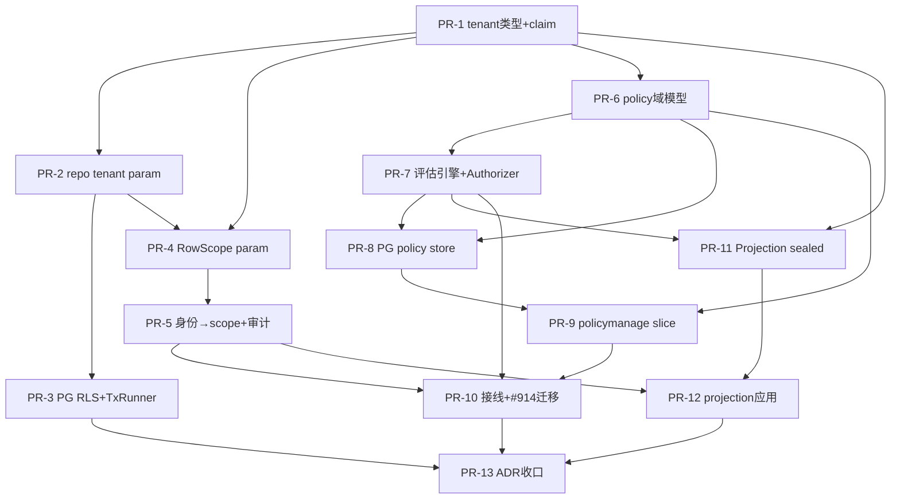
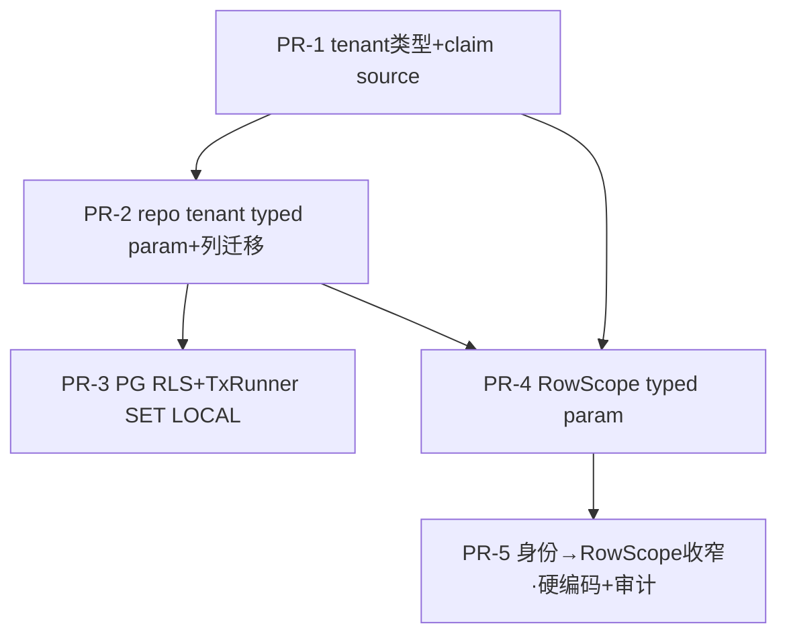

# Tasks: Multi-tenancy + ABAC + Row/Column-Level Data Permission Control

**Input**: `/docs/plans/specs/1220-tenancy-abac-dataperm/` plan.md + spec.md
**Tests**: TDD 强制（每个 PR 先写 `*_test.go`，FAIL→实现）；kernel/ ≥90%，其余 ≥80%。

> **Review 修复纳入（PR #1353 round-1，2 reviewer 六维度）**：本版已吸收 24 条 finding（含 3 处 P0：①configcore/auditcore tenant 迁移补全 ②RowScope=all 强制审计 task ③CTXKEYS allowlist 同 commit）。详见各 PR 内 `[R1]` 标注。

## 拆分原则

- 每个 PR **目标净增删 ≤ 2000 行**（含测试），**接受少量超限**（~10%，即 ≤2200）。仅**显著超限（>2200）**才按 cell 边界切（见 PR-2/PR-10 split contingency），且**不重排 PR 编号**（保持 issue #1339–#1351 映射稳定；切分时新增 `PR-Na/PR-Nb` 子 issue 挂同一父任务）。
- 每个 PR 自带其 enforcement 守卫（archtest / sealed type / governance rule）+ 反向自检 + godoc/ADR——**同 PR 闭环**，不甩 backlog。
- 同一文件只属一个 PR（防写冲突）。
- 破坏式演化（repo 签名、`auth.Authorizer` 签名）直接改，无 shim；涉及 Go interface 签名变更必须出 contract-fanout.md implementation matrix（见 PR-7 T7.4）。

---

## PR 总览（13 个）

| PR | 标题 | 架构层 | US | 行数估算 | 依赖 | 关闭/关联 issue |
|----|------|----|----|---------|------|----------------|
| PR-1 | tenant 类型地基 + claim source | D1 | US1 | ~750 | — | #1296 |
| PR-2 | 平台 repo tenant 强制 typed param + 列迁移（accesscore/auditcore/configcore） | D1/D3 | US1 | ~1900 ⚠ | PR-1 | #1296 |
| PR-3 | PG RLS FORCE + TxRunner SET LOCAL 注入 | D1 | US1 | ~1200 | PR-2 | #1296 |
| PR-4 | RowScope typed obligation + list/get repo param | D3 | US2 | ~1400 | PR-1, PR-2 | #1296, #654 |
| PR-5 | 身份→RowScope 收窄 + RowScope=all 审计 + async 还原测试 | D3 | US2 | ~1100 | PR-4 | #1296 |
| PR-6 | ABAC policy 域模型 + ports + mem store | D2 | US3 | ~1200 | PR-1 | #635 |
| PR-7 | policy 评估引擎 + Authorizer 接口破坏式重做 | D2 | US3 | ~1600 | PR-6 | #635, #1052 |
| PR-8 | PG policy store + conformance + policy readyz probe | D2 | US3 | ~1300 | PR-6, PR-7 | — |
| PR-9 | policymanage slice（L2 写侧 + policy.updated + L2 atomicity） | D2 | US3 | ~1500 | PR-6, PR-8 | — |
| PR-10 | authorizationdecide 接线 + permission-based 迁移 | — | US4 | ~1700 ⚠ | PR-7, PR-5, PR-9 | **#914**, #1055, #645 |
| PR-11 | ResourceProjection sealed framework + FieldMask obligation | D4 | US5 | ~1100 | PR-1, PR-7 | — |
| PR-12 | projection 应用到 auditquery + 读端点 + 暴露 tenantId | D4 | US5 | ~1300 | PR-11, PR-5 | #1219 |
| PR-13 | 跨层 ADR + 扇出收口 | 治理 | US6 | ~600 | all | #645 |

> **架构层标号用 D1–D4**（Data-perm 四层），与 GoCell 一致性等级 **L0–L4 物理无关**——避免「L2 ABAC 决策」被误读为 consistencyLevel L2（authorizationdecide 实际是 L0）。`[R1]`
>
> **⚠ 行数风险（接受少量超限）**：PR-2(~1900)/PR-10(~1700) 是单 PR 体量上限，**接受其少量超限**（用户决策），不为凑行数强行切。**仅当实测显著超（>2200）** 才启用 split contingency（不重排编号）：
> - **PR-2** → PR-2a=accesscore（~1300）、PR-2b=auditcore+configcore（~1100，dep PR-2a 的接口/archtest）。`[R1 F-DX-1]`
> - **PR-10** → PR-10a=composition root 接线 + e2e（~900）、PR-10b=role-literal 迁移 + archtest（~800，dep PR-10a）。`[R1]`

**总估算 ~16,600 行 / 13 PR**（接受 PR-2/PR-10 少量超限），平均 ~1200 行/PR。

---

## 依赖波次（并行调度）



| Wave | 可并行 PR | 说明 |
|------|----------|------|
| W0 | PR-1 | 类型地基 + claim source，全员阻塞前置 |
| W1 | PR-2 ∥ PR-6 | 平台 repo 迁移 与 policy 域模型 互不交叉 |
| W2 | PR-3 ∥ PR-4 ∥ PR-7 | RLS、RowScope param、评估引擎 三路并行 |
| W3 | PR-5 ∥ PR-8 ∥ PR-11 | scope 收窄+审计、PG policy store、projection framework |
| W4 | PR-9 ∥ PR-12 | policymanage、projection 应用 |
| W5 | PR-10 | 接线 + #914 迁移（汇聚 policy + scope + policymanage） |
| W6 | PR-13 | 跨层 ADR 收口 |

关键路径：PR-1 → PR-6 → PR-7 → PR-10 → PR-13（6 波）。

---

## 各 PR 任务明细

### PR-1 — tenant 类型地基 + claim source（W0, ~750, dep: —）
- [ ] T1.1 [P] `pkg/tenant/tenant_id.go`：`TenantID` sealed newtype + 构造器（空值 fail-fast）+ `Validate()`，对齐 `idutil.SafeID`
- [ ] T1.2 [P] `pkg/tenant/rowscope.go`：`RowScope` typed enum `{self,device,tenant,all}`（仅类型，消费在 PR-4）。godoc 注明：`RowScope` 是授权 obligation，置于 `pkg/` 仅为无层依赖可被所有层引用；若取值扩张超 4 值，迁移点为 `pkg/authz/`。`[R1 F-P2-RowScope]`
- [ ] T1.3 `runtime/auth/principal.go`：`PrincipalKind` 枚举增 `PrincipalDevice`（现有 `Unknown/User/Service/Anonymous`）。**`[R1 F-A6]` fanout 前置**：grep 全库 `PrincipalKind` 的 switch/if 穷举点，列清单逐个补 `PrincipalDevice` 分支；新增 `PRINCIPAL-KIND-EXHAUSTIVE-SWITCH-01` archtest（Medium）守 switch 穷举
- [ ] T1.4 `runtime/auth/middleware.go`：`injectPrincipalCtxKeys` 解析 JWT tenant/device claim + service-token 路径 → `ctxkeys.WithTenantID`（消除 "no source on develop"）
- [ ] T1.5 **`[R1 F-A2/F-B3]` 同 commit 落地**：与 T1.4 **同一 commit** 修改 `tools/archtest/ctxkeys_principal_write_caller_test.go` 的 `principalSetterAllowlist["WithTenantID"]` 加入 `runtime/auth/middleware.go`（现仅 `kernel/outbox/principal.go`）+ 反向自检（缺席则 test fail）。**顺序约束**：T1.4 与 T1.5 分开 commit 会在中间态 CI 红灯
- [ ] T1.6 `.claude/rules/gocell/tenancy.md` stub（`[R1 F-A15]` 前移）：建租户/authz 规则导航占位，后续各 PR 增量补充（避免 W6 前 rules 索引长期缺失导致 review 漏检）
- [ ] T1.7 测试：claim 解析（present/missing/malformed）、TenantID 空值拒绝、principalKind 分类

### PR-2 — 平台 repo tenant 强制 typed param + 列迁移（W1, ~1900 ⚠, dep: PR-1）
> `[R1 F-B1]` 范围扩至**三个平台 cell**（原仅 accesscore，configcore/auditcore 漏列会留无谓词窗口期）。超 2000 即按 split contingency 切 PR-2a/2b。
- [ ] T2.1 migration：accesscore（roles/role_assignments/users/sessions）+ auditcore（audit_entries）+ configcore（config_entries/feature_flags）加 `tenant_id` 列（additive）。**`[R1 F-B5]`** 新增 `tenant_id` 列索引用 `CREATE INDEX CONCURRENTLY`（DDL 分离 COMMIT，遵 go-standards.md）
- [ ] T2.2 三 cell `internal/ports/`：repo 接口方法加 `tenant.TenantID` 强制位置参（破坏式，无 shim）
- [ ] T2.3 [P] 三 cell `internal/adapters/postgres/`：PG 实现加 `AND tenant_id=$N` 谓词
- [ ] T2.4 [P] 三 cell `internal/mem/`：mem 实现加 tenant 过滤
- [ ] T2.5 archtest `TENANT-REPO-PARAM-FUNNEL-01`（**`[R1 F-A8]` 评级澄清**：repo 方法签名收 `tenant.TenantID` → 「漏传」是**编译器 Hard**，无需 fixture；archtest 守的不变式 = 「无 repo 方法在 production 接受 plain string 充当 tenant」typed scan，**Medium**；反向自检用 `testdata/tenant_repo_param/violates/` 放一个收 string 的假 repo，断言 archtest 红）
- [ ] T2.6 conformance + unit：三 cell 跨租户查询返回空
- [ ] T2.7 **`[#1339 F2 carryover]` auditquery tenant-scoped 读路径**：PR-1（#1384）落了最小 fail-closed 闸门（`auditQueryPolicy` 在 `p.TenantID != ""` 时 403）作为临时止血。本任务用真隔离替换它——`ledger.AuditFilters` 加 `TenantID` + MemStore/PG `WHERE tenant_id` + auditquery 从认证 `principal.TenantID`（**非 query param**，否则成跨租户入口）注入 filter；**删除该 403 闸门**（`cells/auditcore/slices/auditquery/handler.go::auditQueryPolicy`）+ appender `INV-SINGLE-TENANT-ONLY` tripwire（`cells/auditcore/internal/appender/service.go`）；Store 接口变更走 contract-fanout implementation matrix（MemStore+PG+conformance）。验收：tenant-bearing 请求只见本租户行（不再 403），跨租户查询返回空。

### PR-3 — PG RLS FORCE + TxRunner SET LOCAL（W2, ~1200, dep: PR-2）
- [ ] T3.1 migration：各租户表 `ENABLE` + `FORCE ROW LEVEL SECURITY`（防 table owner bypass）+ tenant_isolation policy（`NULLIF(current_setting('app.tenant_id',true),'')::uuid`）。**`[R1 F-B11]`** ADR/migration 注释明确：应用连接 PG role **不得是 table owner 且无 `BYPASSRLS`**；integration 断言 `SELECT rolbypassrls FROM pg_roles WHERE rolname=current_user` 为 false
- [ ] T3.2 `adapters/postgres/tx_manager.go`：`RunInTx` 起始 `SET LOCAL app.tenant_id`（事务级，归还连接自动撤销，禁裸 `SET`）；空 tenant fail-closed
- [ ] T3.3 pgxpool guard（**`[R1 F-A14/F-B4]` 语义明确**）：`BeforeAcquire(ctx)` 读 `ctxkeys.TenantIDFrom(ctx)`；语义 = 防「非 RunInTx 路径直接借连接执行业务 SQL 却没 SET LOCAL」。行为：若 ctx **有** TenantID 但当前 session 变量未设置 → **fail-fast 拒绝借出（返回 error）**，非 fail-closed-0-行。明确豁免：纯只读探针 / migration / 非业务路径（用专用无 tenant ctx）。T3.3 是 T3.2 的**深度防御**，非替代
- [ ] T3.4 integration（`-tags=integration`）：RLS 真实 PG 兜底（裸 SQL 0 行）；连接池无租户泄漏；BYPASSRLS 断言
- [ ] T3.5 archtest（**`[R1 F-B8]` Soft→Medium**）：`adapters/postgres` 生产文件中 `pgx.Tx.Exec`/`pgconn.Exec` callsite，用 go/types 解析 string literal 实参，若以 `SET ` 开头但非 `SET LOCAL ` → Diagnostic；反向自检 fixture（含裸 `SET` 调用，断言红）

### PR-4 — RowScope typed obligation + list/get repo param（W2, ~1400, dep: PR-1,PR-2）
- [ ] T4.1 `cells/accesscore` + `cells/auditcore`（+ configcore 列表端点）list/get repo 方法加 `RowScope` 强制位置参
- [ ] T4.2 PG/mem 实现：`self`→`owner_id=$`、`device`→`device_id=$`、`tenant`→tenant 全量、`all`→跨租户（仅 super-admin 路径）
- [ ] T4.3 archtest `ROWSCOPE-REPO-PARAM-FUNNEL-01`（同 T2.5 评级范式：漏传=编译器 Hard；typed scan=Medium）+ 反向自检
- [ ] T4.4 测试：四种 scope × user/device 主体矩阵

### PR-5 — 身份→RowScope 收窄 + RowScope=all 审计 + async 还原（W3, ~1100, dep: PR-4）
- [ ] T5.1 `runtime/auth` 或 accesscore：principal → RowScope 推导（非 admin user→self、device→device、admin→tenant、super-admin→all）
- [ ] T5.2 **`[R1 F-B2]` RowScope=all 强制审计**：super-admin 的 `all`（跨租户）路径**必须**写审计——调 `ledger.Append`（或结构化 `slog.Error` 安全事件打点，带 `actor`/`tenant`/`reason`）；acceptance 断言无 `RowScope=all` 请求能绕过审计写入
- [ ] T5.3 重构 auditquery 现有 actor-scoping 复用该推导（删 ad-hoc 逻辑）
- [ ] T5.4 **`[R1 F-A9]` async 租户还原测试**：consumer handler 收到带 `principal.TenantID=acme` 的 entry、bootstrap ctx 无 TenantID 时，断言 handler 内 `ctxkeys.TenantIDFrom(ctx)=="acme"`；且 bootstrap ctx 预设错误 tenant 时 entry restore 覆盖之（防 P1 跨租户污染）
- [ ] T5.5 e2e：三类主体列表可见性

### PR-6 — ABAC policy 域模型 + ports + mem store（W1, ~1200, dep: PR-1）✅ #1344
> **落地偏离 spec 字面（与用户对齐 2026-06-07，见 research.md §1.1）**：
> ① **决策词汇表上框架**：`Decision`/`Effect`/`Obligations`/`FieldMask` 落 **新 leaf 包 `pkg/authz`**（非 `authorizationdecide/domain/`）——`runtime/auth.Authorizer`（PR-7 返回 Decision）受 runtime↛cells 分层约束，`Decision` 必须框架级。`Decision` 为 **sealed construction**（全字段 unexported + `Allow()`/`Deny()` 唯一构造器，防 authz 结论伪造 = P0）；守卫 `AUTHZ-DECISION-SEALED-FIELD-FROZEN-01`（reflect-freeze，Hard）。下游 caller-allowlist（仅引擎可调 Allow/Deny）随 PR-7 producer 落地。
> ② **policy 模型/port/mem 放 cell-shared `internal/`**（`internal/abac` + `internal/ports` + `internal/mem`，非 slice-local）——PR-7 引擎 / PR-8 PG store / PR-9 policymanage 三方复用，slice-local 会破坏 slice 隔离。
- [x] T6.1 `pkg/authz`（Decision/Effect/Obligations/FieldMask，sealed Decision）+ `cells/accesscore/internal/abac/`（Policy/Rule/Condition/Operator/AttributeSource）
- [x] T6.2 `cells/accesscore/internal/ports/policy_repo.go`：PolicyRepository（tenant.TenantID typed param[1]）+ 入列 TENANT-REPO-PARAM-FUNNEL-01
- [x] T6.3 `cells/accesscore/internal/mem/policy_repo.go`（fail-closed Save + defensive clone）
- [x] T6.4 测试：模型不变式 + mem store（跨租户隔离 / clone 独立 / -race）+ AUTHZ-DECISION-SEALED-FIELD-FROZEN-01 archtest

### PR-7 — policy 评估引擎 + Authorizer 接口破坏式重做（W2, ~1600, dep: PR-6）
- [ ] T7.1 评估器：subject(user/device)/resource/env 属性匹配；default-deny + forbid-wins
- [ ] T7.2 fail-closed：store 错误→Deny+`KindUnavailable`；属性缺失→Deny
- [ ] T7.3 env 时间属性经注入 `clock.Clock`（禁 `time.Now()`，遵 CLOCK-POSITIONAL-INJECTION）
- [ ] T7.4 **`[R1 F-A1/F-B10]` Authorizer 接口破坏式重做 + implementation matrix**：现 `auth.Authorizer.Authorize(ctx,subject,resource,action) (bool,error)`（`runtime/auth/auth.go`）**直接替换**为返回 `Decision`（含 obligations RowScope+FieldMask）——无向后兼容（CLAUDE.md）。PR body 出 contract-fanout matrix：
  ```
  Contract: runtime/auth.Authorizer
  Change: Authorize 返回 (bool,error) → (Decision,error)
  Implementations: [ ] authorizationdecide.Service  [ ] test fake/double
  Callers: accesscore.Authorizer() provider（cell_providers.go）+ cmd/ 接线点（PR-10 才真正消费）
  Conformance: TestAuthorizerConformance（mem + PG policy）
  ```
- [ ] T7.5 archtest（Medium）：policy err path 返回 deny；attribute lookup 有 not-found guard；clock 注入
- [ ] T7.6 测试：命中/forbid/缺属性/store-down/device 态势 矩阵

### PR-8 — PG policy store + conformance + readyz probe（W3, ~1300, dep: PR-6,PR-7）
- [ ] T8.1 migration：policy 表（**`[R1 F-B5]`** 索引 `CREATE INDEX CONCURRENTLY`）
- [ ] T8.2 PG store 实现
- [ ] T8.3 conformance suite（mem + PG 跨实现）+ archtest「新实现自动接入 conformance」
- [ ] T8.4 **`[R1 F-B12]` policy readyz**：`PolicyRepository.RepoReady` 探测 policies 表，经 cellgen `RegisterReadiness` funnel 注册 `accesscore_policy_repo_ready`（或 ADR 明确「policy 表降级由 store fail-closed 表达、不进 readyz」择一落地，对齐 observability.md）
- [ ] T8.5 integration

### PR-9 — policymanage slice（W4, ~1500, dep: PR-6,PR-8）
- [ ] T9.1 `cells/accesscore/slices/policymanage/`：policy CRUD（L2 OutboxFact）+ slice.yaml
- [ ] T9.2 contract.yaml：policy HTTP 端点 + `policy.updated` 事件（L2）
- [ ] T9.3 **`[R1 F-B14]` resource-attr 租户一致性 archtest（Medium）**：明确形态——`PolicyRepository.GetAttributes(ctx,resourceID,tenantID)` 的 `tenantID` 实参必须来自同一 ctx 的 `tenant.TenantIDFrom(ctx)`，不可来自独立变量；反向自检 fixture（从不同 ctx 取 tenant，断言红）。守 P0 风险②
- [ ] T9.4 **`[R1 F-A5/F-B6]` L2 atomicity**：明确 policymanage 是 producer（只发 `policy.updated`）还是 hybrid（兼消费）；补 `TestL2Atomicity_policymanage_RollsBack`（`-tags=integration`，testcontainers PG），hybrid 另加 `_ReplayIdempotent`（否则 `L2-OUTBOX-ATOMICITY-COVERAGE-01` nightly 红）
- [ ] T9.5 测试 + contract test（含 contract-fanout 5 载体核对）

### PR-10 — authorizationdecide 接线 + permission-based 迁移（W5, ~1700 ⚠, dep: PR-7,PR-5,PR-9）
- [ ] T10.1 composition root（`cmd/corebundle`）注入 `accesscore.Authorizer()`（PR-7 新 Decision 签名）到业务路由
- [ ] T10.2 业务端点 `RequireRole(literal)` → policy-based authz；删 role-name 字面量授权分支
- [ ] T10.3 archtest（Medium）：业务 handler 无 role-name 字面量授权分支；authorizationdecide 有真实流量 conformance
- [ ] T10.4 e2e：policy deny→403
- [ ] T10.5 **Closes #914**（split 时归 PR-10b）

### PR-11 — ResourceProjection sealed framework + FieldMask（W3, ~1100, dep: PR-1,PR-7）
- [ ] T11.1 **`[R1 F-A4/F-A7]` sealed 机制 + 路径定稿**：`pkg/projection/`（无层依赖，所有层可引用）的 `ResourceProjection`——**全字段 unexported + 唯一构造器** `NewProjection(mask FieldMask, data map[string]any) (ResourceProjection, error)`（对齐 errcode `PublicDetail` sealed marker：包外不可结构字面量伪造）。**`FieldMask` 已在 PR-6（#1344）落 `pkg/authz`**（obligation = 决策输出，与 `Decision`/`Obligations` 同包；ResourceProjection 是 enforcement 机制，**import `pkg/authz.FieldMask`** 而非同包重定义）——偏离原「FieldMask obligation 同包」字面，理由见 research.md §1.1
- [ ] T11.2 projection 构造经 obligation；无 opt-out；复用 `pkg/redaction`。**`[R1 F-A10]` 无裂变**：无 obligation 时 `NewProjection` = identity（不改变可见字段集），使 MVP（PR-1..5，无 masking）与 P2 引入 projection **不产生 response type 破坏式裂变**
- [ ] T11.3 archtest `RESOURCE-PROJECTION-SEALED-01`，godoc 按 ai-robust「Funnel 双向锁」格式举证：上游 Hard（unexported 字段 + 唯一构造器，包外不可构造 full view）+ 下游 Hard（callsite lock）+ 反向自检（handler 返回 full view 不可编译）

### PR-12 — projection 应用到读端点（W4, ~1300, dep: PR-11,PR-5）
- [ ] T12.1 auditquery handler 返回 `ResourceProjection`（mask 敏感列 per user/device）
- [ ] T12.2 **`[R1 F-B7]` contract-fanout**：暴露 `tenantId` DTO（additive omitempty）；更新 auditquery contract.yaml response schema；PR body 含 contract-fanout implementation matrix；迁 forbidden→present 断言；确认 HANDLER-DECL-COVER-01 / DEAD-CONTRACT-01 通过
- [ ] T12.3 **`[R1 F-A10]`「其他读端点」清单化**：枚举受影响 handler（accesscore rbaccheck / configcore 读端点等）+ 各自行数估算（避免 ~1300 低估）；无 obligation 端点用 identity projection
- [ ] T12.4 e2e：admin/非admin/device 三类可见列差异；**关联 #1219**

### PR-13 — 跨层 ADR + 扇出收口（W6, ~600, dep: all）
- [ ] T13.1 ADR ×3（租户隔离 / ABAC 引擎 / 列 masking）+ AI-robust 评级登记（每条 enforcement 的 Hard/Medium 举证写进其 archtest godoc）
- [ ] T13.2 `.claude/rules/gocell/tenancy.md` 收口（PR-1 起各 PR 已增量补，本步只做汇总 + 导航完整性核对）`[R1 F-A15]`
- [ ] T13.3 契约扇出闭环核对（migration / contract.yaml / docs 同步）
- [ ] T13.4 `make verify` 全绿 + 反向自检齐全

---

## 只做多租户的路径（不含 ABAC / 列 masking）

若只交付多租户数据隔离（覆盖 #1296 全范围）= **PR-1/2/3/4/5**，对 ABAC PR(6–10) 与列 masking PR(11/12) **零依赖**：



- **拿到**：租户隔离（typed param + PG RLS 双层 fail-closed）+ 用户/设备级行可见性。
- **不含**：ABAC policy-as-code、列 masking、authz 接线。
- **关键路径**：PR-1→PR-2→PR-4→PR-5（4 波；PR-3 与 PR-4 在 PR-2 后并行）。
- **非废弃**：PR-5 的身份→RowScope 此阶段硬编码；ABAC(PR-7) 落地后只换 obligation 来源（硬编码→policy 发出），PR-4 的 repo typed param 不动。

---

## Implementation Strategy

- **MVP（多租户 only）**：PR-1/2/3/4/5 = 多租户 + 用户/设备级行隔离可独立交付（不含 ABAC 引擎），覆盖 #1296 全范围。
- **能力升级**：PR-6..10 = ABAC policy-as-code 引擎 + 接线 + #914。
- **数据保护完整**：PR-11/12 = 列级 masking。
- 每个 PR 走 ship 流程：worktree → TDD → 实施 → PR(≤2000，超限按 split contingency) → review（按 diff 行数 1/2/3/6 reviewer）→ /fix Cx1/Cx2 → 人工确认。
