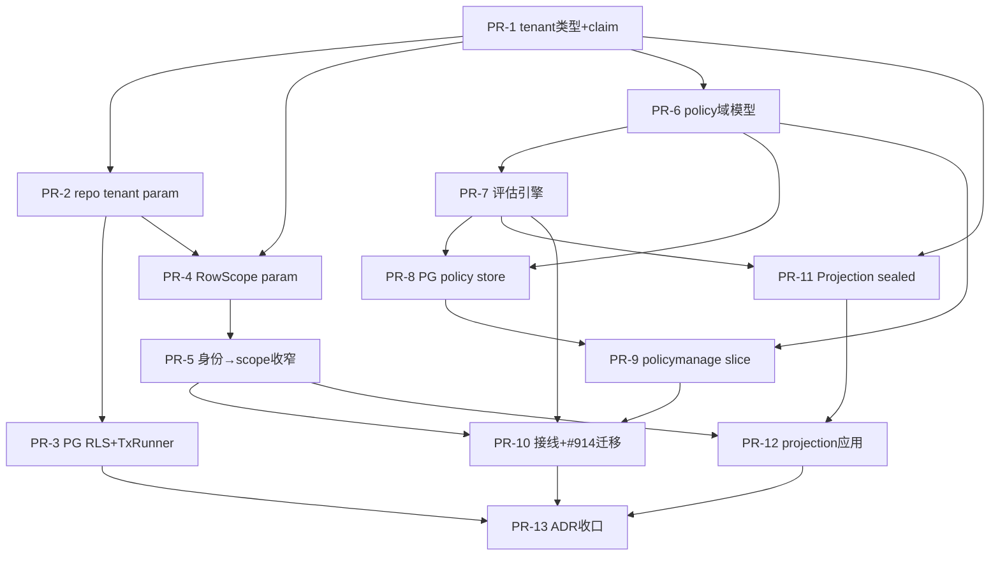

# Tasks: Multi-tenancy + ABAC + Row/Column-Level Data Permission Control

**Input**: `/docs/plans/specs/1220-tenancy-abac-dataperm/` plan.md + spec.md
**Tests**: TDD 强制（每个 PR 先写 `*_test.go`，FAIL→实现）；kernel/ ≥90%，其余 ≥80%。

## 拆分原则

- 每个 PR **净增删 ≤ 2000 行**（含测试）。超限的迁移类 PR 按 cell 边界再切。
- 每个 PR 自带其 enforcement 守卫（archtest / sealed type / governance rule）+ 反向自检 + godoc/ADR——**同 PR 闭环**，不甩 backlog。
- 同一文件只属一个 PR（防写冲突）。
- 破坏式演化（repo 签名、Authorize 签名）直接改，无 shim。

---

## PR 总览（13 个）

| PR | 标题 | 层 | US | 行数估算 | 依赖 | 关闭/关联 issue |
|----|------|----|----|---------|------|----------------|
| PR-1 | tenant 类型地基 + claim source | L1 | US1 | ~700 | — | #1296 |
| PR-2 | accesscore repo tenant 强制 typed param + 列迁移 | L1/L3 | US1 | ~1600 | PR-1 | #1296 |
| PR-3 | PG RLS FORCE + TxRunner SET LOCAL 注入 | L1 | US1 | ~1100 | PR-2 | #1296 |
| PR-4 | RowScope typed obligation + list/get repo param | L3 | US2 | ~1400 | PR-1, PR-2 | #1296, #654 |
| PR-5 | 身份→RowScope 收窄（泛化 actor-scoping） | L3 | US2 | ~900 | PR-4 | #1296 |
| PR-6 | ABAC policy 域模型 + ports + mem store | L2 | US3 | ~1200 | PR-1 | #635 |
| PR-7 | policy 评估引擎（fail-closed + clock + device attr + obligations） | L2 | US3 | ~1500 | PR-6 | #635, #1052 |
| PR-8 | PG policy store + conformance suite | L2 | US3 | ~1200 | PR-6, PR-7 | — |
| PR-9 | policymanage slice（L2 写侧 + policy.updated 事件 + contract） | L2 | US3 | ~1400 | PR-6, PR-8 | — |
| PR-10 | authorizationdecide 接线 + permission-based 迁移 | — | US4 | ~1600 | PR-7, PR-5, PR-9 | **#914**, #1055, #645 |
| PR-11 | ResourceProjection sealed framework + FieldMask obligation | L4 | US5 | ~1000 | PR-1, PR-7 | — |
| PR-12 | projection 应用到 auditquery + 读端点 + 暴露 tenantId | L4 | US5 | ~1100 | PR-11, PR-5 | #1219 |
| PR-13 | 跨层 ADR + 扇出收口 | 治理 | US6 | ~600 | all | #645 |

**总估算 ~14,300 行 / 13 PR**，平均 ~1100 行/PR，最大 PR-2/PR-10 ~1600 行（< 2000 限）。

---

## 依赖波次（并行调度）

| Wave | 可并行 PR | 说明 |
|------|----------|------|
| W0 | PR-1 | 类型地基 + claim source，全员阻塞前置 |
| W1 | PR-2 ∥ PR-6 | 租户 repo 迁移 与 policy 域模型 互不交叉 |
| W2 | PR-3 ∥ PR-4 ∥ PR-7 | RLS、RowScope param、评估引擎 三路并行 |
| W3 | PR-5 ∥ PR-8 ∥ PR-11 | scope 收窄、PG policy store、projection framework |
| W4 | PR-9 ∥ PR-12 | policymanage、projection 应用 |
| W5 | PR-10 | 接线 + #914 迁移（汇聚 policy + scope + policymanage） |
| W6 | PR-13 | 跨层 ADR 收口 |

关键路径：PR-1 → PR-6 → PR-7 → PR-10 → PR-13（6 波）。

---

## 各 PR 任务明细

### PR-1 — tenant 类型地基 + claim source（W0, ~700, dep: —）
- [ ] T1.1 [P] `pkg/tenant/tenant_id.go`：`TenantID` sealed newtype + 构造器（空值 fail-fast）+ Validate，对齐 `idutil.SafeID`
- [ ] T1.2 [P] `pkg/tenant/rowscope.go`：`RowScope` typed enum `{self,device,tenant,all}`（仅类型，消费在 PR-4）
- [ ] T1.3 `runtime/auth/principal.go`：Principal 增 `principalKind ∈ {user,device,service}`
- [ ] T1.4 `runtime/auth/middleware.go`：`injectPrincipalCtxKeys` 解析 JWT tenant/device claim + service-token 路径 → `ctxkeys.WithTenantID`（消除 "no source"）
- [ ] T1.5 archtest：扩展 `CTXKEYS-PRINCIPAL-WRITE-CALLER-01` 覆盖 tenant/device 写入方 allowlist + 反向自检
- [ ] T1.6 测试：claim 解析（present/missing/malformed）、TenantID 空值拒绝、principalKind 分类

### PR-2 — accesscore repo tenant 强制 typed param（W1, ~1600, dep: PR-1）
- [ ] T2.1 migration：accesscore 表（roles/role_assignments/users/sessions）加 `tenant_id` 列（additive）
- [ ] T2.2 `cells/accesscore/internal/ports/`：repo 接口方法加 `tenant.TenantID` 强制位置参（破坏式）
- [ ] T2.3 [P] `internal/adapters/postgres/`：PG 实现加 `AND tenant_id=$N` 谓词
- [ ] T2.4 [P] `internal/mem/`：mem 实现加 tenant 过滤
- [ ] T2.5 archtest `TENANT-REPO-PARAM-FUNNEL-01`（Hard 下游 + 上游 typed param）+ 反向自检（漏传不可编译 fixture）
- [ ] T2.6 conformance + unit：跨租户查询返回空

### PR-3 — PG RLS FORCE + TxRunner SET LOCAL（W2, ~1100, dep: PR-2）
- [ ] T3.1 migration：accesscore 表 `ENABLE` + `FORCE ROW LEVEL SECURITY` + tenant_isolation policy（`NULLIF(current_setting('app.tenant_id',true),'')::uuid`）
- [ ] T3.2 `adapters/postgres/tx_manager.go`：`RunInTx` 起始 `SET LOCAL app.tenant_id`；空 tenant fail-closed
- [ ] T3.3 pgxpool `BeforeAcquire`/guard：连接借出前校验 tenant context（深度防御）
- [ ] T3.4 integration（`-tags=integration`）：RLS 真实 PG 兜底（裸 SQL 0 行）；连接池无泄漏
- [ ] T3.5 archtest：禁裸 `SET`（须 `SET LOCAL`）

### PR-4 — RowScope typed obligation + list/get repo param（W2, ~1400, dep: PR-1,PR-2）
- [ ] T4.1 `cells/accesscore` + `cells/auditcore` list/get repo 方法加 `RowScope` 强制位置参
- [ ] T4.2 PG/mem 实现：`self`→`owner_id=$`、`device`→`device_id=$`、`tenant`→tenant 全量、`all`→跨租户（仅 super-admin 路径）
- [ ] T4.3 archtest `ROWSCOPE-REPO-PARAM-FUNNEL-01`（Hard）+ 反向自检
- [ ] T4.4 测试：四种 scope × user/device 主体矩阵

### PR-5 — 身份→RowScope 收窄（W3, ~900, dep: PR-4）
- [ ] T5.1 `runtime/auth` 或 accesscore：principal → RowScope 推导（非 admin user→self、device→device、admin→tenant、super-admin→all）
- [ ] T5.2 重构 auditquery 现有 actor-scoping 复用该推导（删 ad-hoc 逻辑）
- [ ] T5.3 e2e：三类主体列表可见性

### PR-6 — ABAC policy 域模型 + ports + mem store（W1, ~1200, dep: PR-1）
- [ ] T6.1 `cells/accesscore/slices/authorizationdecide/domain/`：Policy/Rule/Condition/Decision/obligations 模型
- [ ] T6.2 ports：PolicyRepository 接口
- [ ] T6.3 mem store
- [ ] T6.4 测试：模型不变式 + mem store

### PR-7 — policy 评估引擎（W2, ~1500, dep: PR-6）
- [ ] T7.1 评估器：subject(user/device)/resource/env 属性匹配；default-deny + forbid-wins
- [ ] T7.2 fail-closed：store 错误→Deny+KindUnavailable；属性缺失→Deny
- [ ] T7.3 env 时间属性经注入 `clock.Clock`（禁 `time.Now()`）
- [ ] T7.4 输出 obligations（RowScope + FieldMask）；扩展 `auth.Authorizer` 签名为 Decision
- [ ] T7.5 archtest（Medium）：policy err path 返回 deny；attribute lookup 有 not-found guard；clock 注入
- [ ] T7.6 测试：命中/forbid/缺属性/store-down/device 态势 矩阵

### PR-8 — PG policy store + conformance（W3, ~1200, dep: PR-6,PR-7）
- [ ] T8.1 migration：policy 表
- [ ] T8.2 PG store 实现
- [ ] T8.3 conformance suite（mem + PG 跨实现）+ archtest「新实现自动接入 conformance」
- [ ] T8.4 integration

### PR-9 — policymanage slice（W4, ~1400, dep: PR-6,PR-8）
- [ ] T9.1 `cells/accesscore/slices/policymanage/`：policy CRUD（L2）+ slice.yaml
- [ ] T9.2 contract.yaml：policy HTTP 端点 + `policy.updated` 事件（L2 OutboxFact）
- [ ] T9.3 resource-attr 查询与主查询共享 tenant（archtest Medium）
- [ ] T9.4 测试 + contract test

### PR-10 — authorizationdecide 接线 + permission-based 迁移（W5, ~1600, dep: PR-7,PR-5,PR-9）
- [ ] T10.1 composition root（`cmd/corebundle`）注入 `accesscore.Authorizer()` 到业务路由
- [ ] T10.2 业务端点 `RequireRole(literal)` → policy-based authz；删 role-name 字面量授权分支
- [ ] T10.3 archtest（Medium）：业务 handler 无 role-name 字面量授权分支；authorizationdecide 有真实流量 conformance
- [ ] T10.4 e2e：policy deny→403
- [ ] T10.5 **Closes #914**

### PR-11 — ResourceProjection sealed framework + FieldMask（W3, ~1000, dep: PR-1,PR-7）
- [ ] T11.1 `ResourceProjection` sealed type + `FieldMask` obligation（对齐 errcode `PublicDetail` sealed marker）
- [ ] T11.2 projection 构造经 obligation；无 opt-out；复用 `pkg/redaction`
- [ ] T11.3 archtest `RESOURCE-PROJECTION-SEALED-01`（Hard）+ 反向自检（handler 返回 full view 不可编译）

### PR-12 — projection 应用到读端点（W4, ~1100, dep: PR-11,PR-5）
- [ ] T12.1 auditquery handler 返回 `ResourceProjection`（mask 敏感列 per user/device）
- [ ] T12.2 暴露 `tenantId` DTO（additive omitempty）；迁 forbidden→present 断言
- [ ] T12.3 其他读端点接 projection
- [ ] T12.4 e2e：admin/非admin/device 三类可见列差异；**关联 #1219**

### PR-13 — 跨层 ADR + 扇出收口（W6, ~600, dep: all）
- [ ] T13.1 ADR ×3（租户隔离 / ABAC 引擎 / 列 masking）+ AI-robust 评级登记
- [ ] T13.2 `.claude/rules/gocell/` 索引更新（tenant/authz 规则导航）
- [ ] T13.3 契约扇出闭环核对（migration / contract.yaml / docs 同步）
- [ ] T13.4 `make verify` 全绿 + 反向自检齐全

---

## Implementation Strategy

- **MVP**：W0+W1+W2 的 PR-1/2/3/4/5 = 多租户 + 用户/设备级行隔离可独立交付（不含 ABAC 引擎）。这覆盖 #1296 主线 + US1/US2。
- **能力升级**：W1-W5 的 PR-6..10 = ABAC policy-as-code 引擎 + 接线 + #914。
- **数据保护完整**：W3-W4 的 PR-11/12 = 列级 masking。
- 每个 PR 走 ship 流程：worktree → TDD → 实施 → PR(≤2000) → review（按 diff 行数 1/2/3/6 reviewer）→ /fix Cx1/Cx2 → 人工确认。
