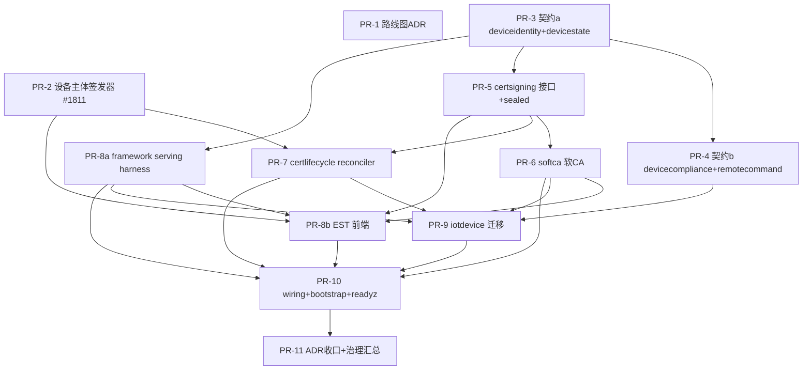

# Tasks: 设备身份与证书框架化 + MDM/ZT 前期地基

**Input**: `/docs/plans/specs/1895-device-identity-cert-framework/` plan.md + spec.md
**Epic**: #1895
**Tests**: TDD 强制（每个 PR 先写 `*_test.go`，FAIL→实现）；runtime/kernel ≥90%，其余 ≥80%。

## 拆分原则

- 每个 PR **目标净增删 ≤ 2000 行**（含测试），接受少量超限（~10%，≤2200）；显著超限（>2200）才按子任务切（`PR-Na/PR-Nb`，不重排编号）。
- 每个 PR 自带其 enforcement 守卫（archtest / sealed type / governance rule）+ 反向自检 + godoc/ADR——**同 PR 闭环**，不甩 backlog。
- 同一文件只属一个 PR（防写冲突）。
- 破坏式演化（`rotate-cert` 字符串→真契约、iotdevice 迁移）直接改，无 shim；涉及契约/接口签名变更出 contract-fanout implementation matrix。
- **私钥不出 adapter** + **`Sign` 唯一签发入口**是贯穿不变式，每个触及证书材料的 PR 必须守。

---

## 前置机制（Wave 1 期间衍生，已闭）

- **#1939 framework-owned contract**（ADR `202606130635-1939`，PR #1945）：中立 provider-agnostic 契约由**框架**归属（sealed `ContractOwner = Cell|Framework`，`ownerCell: _framework`），不绑单一 Cell。PR-3（#1899）落地时衍生，1895-ADR D5 预埋前向引用。**后果**：7 个设备契约均 `ownerCell: _framework` + `lifecycle: draft`，有 generated handler 但无挂载点；framework HTTP serving（`contract.yaml→RouteGroup` 派生 + serving-scan 治理 + Journey）由 #1939 ADR 显式延后到 active 化 PR → **新增 PR-8a 承载**（原 PR 分解未含）。

## PR 总览（12 个）

| PR | 标题 | 架构层 | US | 行数估算 | 依赖 | 关闭/关联 issue |
|----|------|--------|----|---------|------|----------------|
| PR-1 | 路线图修订 ADR（设备证书框架化决议） | 治理/docs | US6 | ~500 | — | 关联 #995 #1051 #1052 |
| PR-2 | 生产级设备/super-admin 主体签发器 | runtime/auth | US1 | ~1500 | — | **关闭 #1811** |
| PR-3 | 中立契约 (a)：deviceidentity + devicestate | contracts | US4 | ~1400 | — | 关联 #1052 #1939 |
| PR-4 | 中立契约 (b)：devicecompliance + remotecommand | contracts | US4 | ~1400 | PR-3 | 关联 #1052 |
| PR-5 | `runtime/certsigning` 接口 + sealed 类型 + funnel | runtime | US2 | ~1500 | PR-3 | 关联 #995 |
| PR-6 | `adapters/softca` 内置软 CA（Signer + CRL） | adapters | US2 | ~1700 | PR-5 | 关联 #995 |
| PR-7 | `runtime/certlifecycle` 生命周期 reconciler | runtime | US2 | ~1900 ⚠ | PR-5, PR-2 | 关联 #995 #1870 |
| PR-8a | framework HTTP serving harness + 契约 draft→active | runtime/http | US3 | ~1500 | PR-3 | 关联 #1939 #1052 |
| PR-8b | EST(RFC 7030) 框架注册前端 | runtime/http | US3 | ~1500 | PR-5, PR-6, PR-2, PR-8a | 关联 #995 |
| PR-9 | iotdevice 迁移 + `rotate-cert` 真契约 + 设备 enqueue RBAC | examples | US5 | ~1800 | PR-4, PR-6, PR-7, PR-8a | **关闭 #654**，关联 #1870 |
| PR-10 | composition wiring + bootstrap option + readyz + docs/ops | cellmodules | US2/3 | ~1100 | PR-6,7,8a,8b,9 | 关联 #1085 |
| PR-11 | 跨层 ADR 收口 + 扇出闭环 + 治理 invariant 汇总 | 治理 | US6 | ~700 | all | 关联 #995 |

**总估算 ~16,600 行 / 12 PR**，平均 ~1380 行/PR。PR-7(~1900) 接受少量超限；实测 >2200 才切（`PR-7a` lifecycle 状态机 / `PR-7b` fencing+多租户 sweep）。PR-8 拆为 PR-8a（serving harness）/ PR-8b（EST 协议前端），不重排 9-11 编号。

---

## 依赖波次（并行调度）

| Wave（设计时，从 PR-1 起算） | 可并行 PR | 说明 |
|------|----------|------|
| 1 | PR-1, PR-2, PR-3 | ADR / 设备主体 / 契约 a 互不依赖 |
| 2 | PR-4, PR-5, PR-8a | 均依赖 PR-3（契约范式/deviceidentity 形状）；PR-8a = framework serving harness（#1939 延后项） |
| 3 | PR-6, PR-7 | 依赖 PR-5（接口）；PR-7 另依赖 PR-2（PrincipalDevice） |
| 4 | PR-8b, PR-9 | PR-8b 依赖 5/6/2/8a；PR-9 依赖 4/6/7/8a |
| 5 | PR-10, PR-11 | wiring 后收口 |

> 注：上表为**设计时 DAG 绝对 wave**（从 PR-1 起算）。Wave 1（PR-1/2/3）已全部 CLOSED；**实时滚动 Wave**（机器单源 = GitHub Project #3 Wave 字段，仅排 OPEN 子任务，设计 Wave 2-5 → 滚动 W1-W4）：W1 PR-5/PR-4/PR-8a · W2 PR-6/PR-7 · W3 PR-8b/PR-9 · W4 PR-10 · **超窗(>W4)** PR-11（依赖 all，滚动后落 W5 超 cap，不入 Project Wave 字段）。

---

## Phase 0：治理对齐（US6 前置部分）

### PR-1 路线图修订 ADR（设备证书框架化决议）~500 行 · docs-only

**Goal**：把范围决策固化为 ADR，修订 4 份已锁定路线图文档，避免「PKI 不在框架」残留语义与本 epic 冲突。

- [ ] T1.1 新建 `docs/architecture/202606121500-1895-adr-device-cert-framework-pivot.md`：决议（证书进框架 / 底座+softca+EST / 4 中立契约 / 设备主体签发器）、对标依据、层放置（runtime+adapter+contracts）、威胁矩阵（私钥边界 / Sign funnel / Authorize-Sign 分离）。
- [ ] T1.2 修订 `docs/plans/product-roadmap/202604301030-winmdm-prd-on-gocell.md`：pkicell 落点注记（框架底座下移 core，winmdm 仅留 WSTEP/SCEP 前端 + caworkflow）。
- [ ] T1.3 修订 `202604300900-gocell-as-platform-foundation.md` §3 + `plan-d-...md` §10：plan-D §10「v1.0 前不建 mdm/」加例外注记（本 epic 全落 core，不建 module）。
- [ ] T1.4 修订 `engineering-baseline/202604300800-final-form-capability-overview.md`：final-form 增列「设备身份与证书底座」能力。
- [ ] T1.5 更新 #995/#1051/#1052 锚点（评论指针，不重写锚点 body——锚点 body 改由 ADR 承载）。

> **enforcement**：无新静态守卫（docs）；但 ADR 是后续 PR 的威胁矩阵单源。

---

## Phase 1：设备主体地基（US1，硬前置）

### PR-2 生产级设备/super-admin 主体签发器（#1811）~1500 行

**Goal**：补齐生产 authn 铸造 `PrincipalDevice` / super-admin，消除「develop 无生产来源」。

- [ ] T2.1 [TDD] `runtime/auth/deviceprincipal_test.go`：device token → PrincipalDevice（subject/tenant）；super-admin → RowScope=all + 审计；service-token 不派生 device。
- [ ] T2.2 `runtime/auth/deviceprincipal.go`：设备主体签发器（device token 验证 → 铸造 PrincipalDevice）；wire 到 `injectPrincipalCtxKeys`；写入方同 commit 加 `CTXKEYS-PRINCIPAL-WRITE-CALLER-01` allowlist。
- [ ] T2.3 super-admin 主体路径 + `RowScope=all` 强制审计（复用 ROWSCOPEALL-AUDIT-FUNNEL-01）。
- [ ] T2.4 enforcement：`DEVICE-PRINCIPAL-MINT-CALLER-01`（Medium，签发器为唯一 device 主体来源）+ 反向自检；godoc §invariants。
- [ ] T2.5 概念隔离测试：service ≠ device、callerCellID ≠ device subject。

> **关闭 #1811**。证书 mTLS 派生 PrincipalDevice 为统一终态（PR-8b `/simplereenroll` client-cert 已用）；本 PR 提供 device-token 路径，二者并存。实际交付额外做了 **sealed PrincipalDevice 构造 + seal-aware test helper + `principal_kind` fail-closed**——下游（PR-7/PR-8b/PR-9）铸造/测试 PrincipalDevice 必须走 sealed funnel，不裸构造。

---

## Phase 2：中立契约（US4）

### PR-3 中立契约 (a)：deviceidentity + devicestate ~1400 行

**Goal**：定义证书/身份之家 `deviceidentity/v1` + 在线态 `devicestate/v1`。

- [ ] T3.1 [TDD] 契约级测试：正常 schema / 参数错误 / 鉴权边界 / path 校验。
- [ ] T3.2 `contracts/http/deviceidentity/{enroll,renew,revoke,status}/v1/contract.yaml` + schema（PKCS#10/PKCS#7 wire 形状、证书状态）。
- [ ] T3.3 `contracts/event/deviceidentity/{cert-issued,cert-revoked}/v1/`（L2 outbox 事实 schema）。
- [ ] T3.4 `contracts/http/devicestate/v1/`（online/offline/last-seen 查询）。
- [ ] T3.5 codegen（`gocell generate`）→ generated handler/client/types；slice.yaml `contractUsages` 派生 registration。
- [ ] T3.6 contract-fanout implementation matrix（contract/generated/cell-slice/tests/docs）。

> **实际交付（#1899 CLOSED，PR #2010）**：(1) 全部契约经 **#1939 framework-owned**（`ownerCell: _framework` + `lifecycle: draft`，无 cell 挂载点；serving 留 PR-8a）；(2) **status 契约收窄为 deviceId-only**——禁裸 serial / 半指定 issuer 查询，specific-cert lookup 必须经 serving 层 typed `CertScope`（isolation invariant，对齐 PR-5 CertScope）。

### PR-4 中立契约 (b)：devicecompliance + remotecommand ~1400 行

**Goal**：定义合规 `devicecompliance/v1`（喂 Authorize 决策的设备态势）+ 远程命令 `remotecommand/v1`（承接既有 enqueue 形状）。依赖 PR-3 的 codegen 范式 + archtest。

- [ ] T4.1 [TDD] 契约级测试（同 PR-3 范式）。
- [ ] T4.2 `contracts/http/devicecompliance/v1/`（BitLocker/AV/补丁/防火墙等态势属性查询）。
- [ ] T4.3 `contracts/command/remotecommand/v1/`：字段形状对齐既有 `command.devicecommand.enqueue.v1`（PR-9 迁移目标）。
- [ ] T4.4 codegen + slice 派生 + fanout matrix。
- [ ] T4.5 enforcement：契约 schema reflect-freeze（DTO 字段集冻结）+ active-subscriber 警告（死契约）。

---

## Phase 3：证书签发底座（US2）

### PR-5 `runtime/certsigning` 接口 + sealed 类型 + funnel ~1500 行

**Goal**：定义 CA 接缝 + 协议无关请求模型 + 单一签发 funnel。

- [ ] T5.1 [TDD] `request_test.go`：CertRequest/IssuedCert 包外不可字面量构造（sealed）；唯一构造器校验。
- [ ] T5.2 `signer.go`：`Signer{ Sign(ctx, CertRequest)(IssuedCert,error); TrustBundle(ctx) }`。
- [ ] T5.3 `authorizer.go`：`Authorizer{ AuthorizeEnroll(ctx, EnrollmentClaim)(SignConstraints,error) }`——**独立**于 Signer；nil grant fail-closed；SignConstraints（max TTL / 允许 SAN）。
- [ ] T5.4 `request.go`：`CertScope`（`{tenant,issuer,device}`，Sign/Revoke/List 共用）/`CertRequest`/`IssuedCert`/`DeviceSubject`/`SubjectAltNames`/`KeyUsages` sealed（unexported + 唯一构造器，typed tenant+issuer+device 非裸 string/serial）。
- [ ] T5.5 `revocation.go`：`RevocationStore{ Revoke(ctx,CertScope,serial,reason); RevocationList(ctx,CertScope); Tidy(ctx,CertScope,before) }`——`CertScope` 强制 typed 位置参（漏传编译错 Hard）；跨租户/issuer fail-closed。
- [ ] T5.6 enforcement：`CERT-VALUE-SEALED-CONSTRUCTION-01`（Hard，证书值不可伪造）+ `CERT-SIGN-FUNNEL-01`（funnel：上游 Hard = CertRequest/IssuedCert sealed 构造；下游 Medium = archtest 扫单一 Sign callsite）+ `CERT-REVOKE-SCOPED-01`（Hard，Revoke/RevocationList 带 `CertScope` typed 位置参，漏传编译错——对齐 tenant typed-param 范式）+ 反向自检；`doc.go` §Enforced invariants。
- [ ] T5.7 新增 `ERR_CERT_` 前缀注册 + golden（ERRCODE-PREFIX-OWNERSHIP-01）。

### PR-6 `adapters/softca` 内置软 CA ~1700 行

**Goal**：标准库实现 `Signer`+`RevocationStore`，私钥经 `crypto.Signer` 托管**永不出 adapter**。

- [ ] T6.1 [TDD] 集成测试（testcontainers/纯内存）：签发链可验证、续期 epoch+1、吊销入 CRL、TTL clamp。
- [ ] T6.2 `adapters/softca/go.mod`（per-adapter module，对齐 #1558 拆分）。
- [ ] T6.3 `ca.go`：CA 层级（root + intermediate）+ key 托管接口（dev mem/file；KMS/HSM 留后续 adapter，明确 no-op 业务理由）。
- [ ] T6.4 `signer.go`：实现 `certsigning.Signer`（`x509.CreateCertificate` + SignConstraints 强制）。
- [ ] T6.5 `revocation.go`：实现 `RevocationStore`（`x509.CreateRevocationList` + tidy）。
- [ ] T6.6 enforcement：`CERT-PRIVATE-KEY-CUSTODY-01`（custody：上游 Hard = `Signer` 接口不暴露 key getter；下游 Medium = archtest 扫 certsigning 边界外无 PrivateKey 字段）+ 反向自检。

### PR-7 `runtime/certlifecycle` 生命周期 reconciler ~1900 行 ⚠

**Goal**：把 iotdevice 种子泛化为可复用 `reconcile.Reconciler`，驱动证书生命周期状态机，复用 `kernel/reconcile.Loop` + `runtime/command`。依赖 PR-5（接口）+ PR-2（PrincipalDevice）。

- [ ] T7.1 [TDD] `reconciler_test.go`：requested→issued→active→near-expiry→renewing→{rotated|revoked|expired} 转换；签名失败不损坏既有证书；fail-closed deny 不签发。
- [ ] T7.2 [TDD] `reconciler_loop_test.go`：resync-all sweep 有界扫描；多副本 `LeaseToken.Epoch` fencing；队列 active-uniqueness 至多一次有效签发。
- [ ] T7.3 `reconciler.go`：`reconcile.Reconciler` 实现；`clock.Clock` 位置参 + `MustHaveClock`；jitter 续期（k8s 70-90% 模型）；Authorize→Sign→persist→emit `cert-issued` L2。
- [ ] T7.4 `repository.go`：`DeviceCertRepository`（scan near-expiry by cutoff / persist epoch+cert / mark）接口；specific-cert 查询经 typed `CertScope`（PR-5），**非裸 serial**（status 契约已收窄 deviceId-only，#1899）。
- [ ] T7.5 **多租户维度**：scan + 命令 key + 签发请求自带 tenant（system identity 清空 tenant，#1821 caveat）。
- [ ] T7.6 enforcement：复用 `RECONCILE-FENCED-WRITE-FUNNEL-01`（Hard）；新增 `CERTLIFECYCLE-SIGN-VIA-FUNNEL-01`（Medium，生命周期只经 certsigning.Signer 签发）+ 反向自检；`doc.go`。

> 注记：铸造/测试 PrincipalDevice 走 PR-2 的 **sealed funnel + seal-aware test helper**（#1898 实际交付），不裸构造。

---

## Phase 4：协议前端 + 消费方迁移（US3/US5）

### PR-8a framework HTTP serving harness + 契约 draft→active ~1500 行

**Goal**：落地 #1939 ADR 延后的 framework HTTP serving 基建——从 framework-owned `contract.yaml` 派生 RouteGroup + bootstrap 挂载，把悬空的 deviceidentity/devicestate draft 契约转为可 serve 的 active 框架契约。PR-8b/9/10 硬前置。依赖 PR-3。

- [ ] T8a.1 [TDD] `contract.yaml → RouteGroup` 派生测试；未 serve 的 active 框架契约 fail-closed（red case，anti-vacuity）；缺 Journey 引用 red case。
- [ ] T8a.2 `runtime/internal/contractbuild`：新增「从 framework-owned `contract.yaml` 派生 `ContractSpec`」入口（区别于现字面量 `NewFrameworkHTTP`；id/method/path/schema 取自解析的 contract，与 codegen 单源）。
- [ ] T8a.3 `runtime/bootstrap`：framework RouteGroup 挂载 framework-owned http 契约（listener + auth plan **显式声明**，in-process 不 bypass listener auth）。
- [ ] T8a.4 扩展 `FRAMEWORK-OWNED-CONTRACT-SCOPED-01`（#1939 D3）为 **serving-scan**：放行已 serve 的 active 框架契约（DEAD-CONTRACT-01 的框架版）+ synthetic red case。
- [ ] T8a.5 首批只读契约 `http.devicestate.v1`（+ `http.deviceidentity.status.v1`，视 cert 持久化就绪）`draft→active` + framework handler；写路径（enroll/renew/revoke/rotate）的 active 化留 PR-8b/PR-9 经本 harness 落地。
- [ ] T8a.6 Journey coverage：转 active 的框架契约补 `JOURNEY-CONTRACT-EXISTENCE-01` 引用（如 `J-deviceidentity`）。

> **enforcement**：`FRAMEWORK-OWNED-CONTRACT-SCOPED-01` serving-scan 扩展（Medium）+ 反向 red case；RouteGroup 派生口与 `contract.yaml` 单源（复用 codegen funnel）。同 PR 闭环。

### PR-8b EST(RFC 7030) 框架注册前端 ~1500 行

**Goal**：框架级 EST 端点，经 PR-8a framework serving harness 挂 `/api/v{N}/deviceidentity/est/*`，wiring Authorizer→Signer。依赖 PR-5/6/2/8a。

- [ ] T8b.1 [TDD] handler 测试：`/simpleenroll` 200 PKCS#7、畸形/越权 CSR 4xx、缺鉴权 / setup-bootstrap 冒充 401/403、`/cacerts` 返回信任根。
- [ ] T8b.2 `runtime/http/est/handler.go`：`cacerts`·`simpleenroll`·`simplereenroll`（PKCS#10 in / PKCS#7 out），经 PR-8a framework RouteGroup 挂 `/api/v{N}/deviceidentity/est/*`（**framework serving，非「所属 cell 前缀」**——deviceidentity 框架归属无 owner cell；path 段 deviceidentity 是 domain 非 cell）。
- [ ] T8b.3 鉴权两路径：首次=**专用 enrollment-credential / device-token**（PR-2 设备主体；**PrincipalDevice 现为 sealed，经签发器铸造**，**非** setup `auth.bootstrap:true`），续期=现证书 mTLS client-auth（`runtime/http/middleware/mtls` + PeerIdentity）。
- [ ] T8b.4 EST `auth.Route` 声明：显式 enrollment-credential / mTLS scheme；**不**声明 `auth.bootstrap:true`（FMT-28 限其只在 `^/api/v\d+/[^/]+/setup/admin$`，EST 非该路径，复用 fail-closed）。
- [ ] T8b.5 写路径 deviceidentity 契约（enroll/renew）经 PR-8a harness `draft→active`（serving-scan 放行）。
- [ ] T8b.6 enforcement：`EST-ENROLL-AUTH-BOUNDARY-01`（Medium，enroll/reenroll 鉴权路径显式声明 + 禁 setup-bootstrap 凭据复用，缺则 fail-closed）+ 反向自检。

### PR-9 iotdevice 迁移 + `rotate-cert` 真契约 + 设备 enqueue RBAC ~1800 行

**Goal**：示例端到端切到框架证书底座，证明接缝。依赖 PR-4/6/7/8a。

- [ ] T9.1 [TDD] iotdevice 集成：注册→softca 签真实初始证书→近期过期→certlifecycle 续期→新证书生效。
- [ ] T9.2 `deviceregister` 经 `certsigning.Signer` 签真实初始证书（替代仅 stamp `cert_expires_at`）。
- [ ] T9.3 `devicecertrenewal` slice 退役 / 重接 `certlifecycle`（删字符串 `rotate-cert`，无 shim）。
- [ ] T9.4 `command.deviceidentity.rotate.v1` 真契约取代 bare-string `CommandType="rotate-cert"`；fanout matrix。（command kind 带 cell 内部语义，仍 **cell-owned** 正常 serve；非 framework-owned。）
- [ ] T9.5 设备粒度 enqueue 授权（#654）：设备不可操作他设备命令（`auth.RequirePermission` + RowScope=device，无 role-literal）。
- [ ] T9.6 迁移：devices 行证书列 + migration（cert material 持久化）；删除退役列（只增不改例外须 ADR 注记）。
- [ ] T9.7 cert 状态/查询走 typed `CertScope`（PR-5），不依赖裸 serial（status 契约已收窄 deviceId-only，#1899）；消费 PR-2 sealed PrincipalDevice（device-token 路径走 sealed funnel）。

> **关闭 #654**；**关联 #1870**（cert terminal-feedback——续期释放主路径基础留 PR-7 时间窗 + 本 PR 真契约 terminal 态）。另：#1943（device 幂等 middleware bypass）forward-looking 至本 PR（device 写端点落地时一并处理）。

---

## Phase 5：装配 + 收口（US2/3/US6）

### PR-10 composition wiring + bootstrap option + readyz + docs/ops ~1100 行

**Goal**：把证书底座装配进 composition root，对外暴露 option + readyz + 运维文档。依赖 PR-6/7/8a/8b/9。

- [ ] T10.1 [TDD] bootstrap option fail-fast 测试（缺 Signer fail-fast，不静默 noop）。
- [ ] T10.2 `bootstrap.WithCertSigner` / `WithCertLifecycle` option（强依赖 fail-fast）；cellmodules 绑定 softca↔certsigning。
- [ ] T10.3 readyz probe：`certsigner_ready`（CA 可用性，复合 readyz）。
- [ ] T10.4 metrics cell label（closed set）+ cert 签发/吊销/续期 metric（typed enum 入口）。
- [ ] T10.5 docs/ops：cert 运维 runbook（CA 轮换 / CRL 发布 / 续期监控）+ quickstart。

### PR-11 跨层 ADR 收口 + 扇出闭环 + 治理 invariant 汇总 ~700 行

**Goal**：收口跨层 ADR、扇出、治理 invariant 汇总 + 威胁矩阵复检。依赖 all。

- [ ] T11.1 跨层 ADR：证书底座完整威胁矩阵（私钥边界 / Sign funnel / Authorize-Sign 分离 / lifecycle fencing / EST 鉴权）。
- [ ] T11.2 治理 invariant 汇总文档（CERT-* 族 ID / 评级 / 盲区写入对应 archtest godoc）。
- [ ] T11.3 `make verify` 全绿；每条 invariant 反向自检 + anti-vacuity。
- [ ] T11.4 复检 PR-1 ADR 威胁矩阵 vs 实现；冲突段落重写（AI-robust §审查）。
- [ ] T11.5 收口 #995（评论结论 + 关闭）；更新 status-board / journey（如新增 J-deviceenroll）。

---

## Dependencies & Execution Order

### 关键路径

`PR-3 → {PR-5 · PR-8a 并行} → PR-6/7 · PR-8b/9 → PR-10 → PR-11`（约 5 wave）。PR-8a（serving harness）依赖 PR-3、阻塞 PR-8b/9/10——是关键路径节点（非旁路），可在 Wave 2 与 PR-5 并行起跑。PR-1（ADR）+ PR-2（设备主体）可与 PR-3 并行起跑。

### Within Each PR

- TDD：先写 `*_test.go`，FAIL→实现。
- sealed 类型/接口 before 实现 before wiring。
- 每 PR 守卫 + 反向自检 + godoc/ADR **同 PR 闭环**。

### 风险点

- **PR-7 体量**（~1900）：实测 >2200 切 `PR-7a`（状态机）/`PR-7b`（fencing+多租户 sweep），不重排编号。
- **PR-9 破坏式迁移**：删字符串命令 + 退役列，须 fanout matrix + migration ADR 注记。
- **私钥边界**贯穿 PR-5/6/7/8：每个触及证书材料的 PR 守 `CERT-PRIVATE-KEY-CUSTODY-01`。

## Notes

- 行数估算含测试；超限以实测 `git diff --shortstat origin/develop` 为准。
- [Story] 映射：PR-1/11→US6，PR-2→US1，PR-3/4→US4，PR-5/6/7→US2，PR-8a/8b→US3，PR-9→US5，PR-10→US2/3。
- 每 PR 经 ship→review→fix→check 流程；契约 PR 出 implementation matrix。
