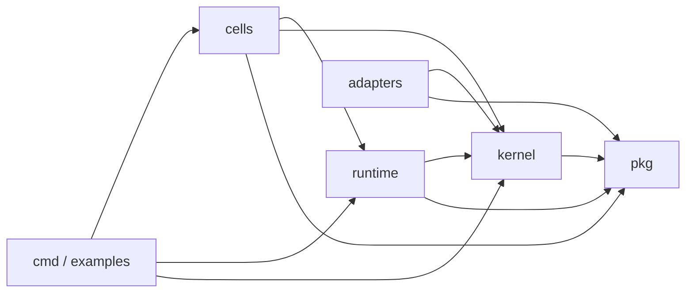
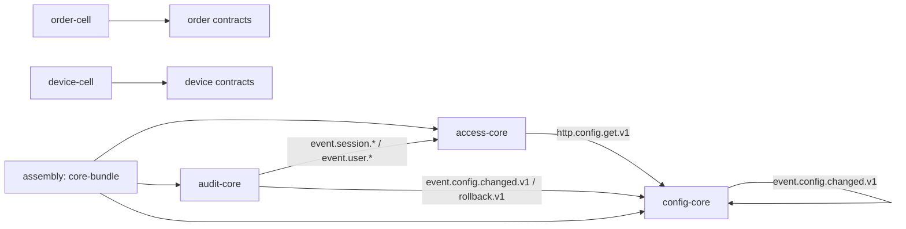

# PR #7 起三套代码 Review 计划

> 日期: 2026-04-06
> 仓库: `ghbvf/gocell`
> 起点: GitHub PR #7
> 已有基线: `docs/reviews/202604051500-032-phase3-pr7-12-six-role-review.md`
> 详细执行版: `docs/reviews/20260406-pr7-onward-detailed-review-execution-plan.md`

## 适用范围

从当前仓库历史看, `PR #7` 之后可自然分成 4 个 review 批次 + 1 条 follow-up issue 修复带:

| 类型 | 编号 | 主题 | 适合的审查粒度 |
|---|---|---|---|
| Batch A | PR #7 ~ #12 | Phase 3 Wave 0/1, runtime/pkg/devops/postgres/redis/rabbitmq | 逐 PR |
| Follow-up Lane | Issue #18 ~ #27 | `PR #7 ~ #12` post-merge follow-ups, 通过 forward-fix PR 处理 | 按问题簇审查 |
| Batch B | PR #13 ~ #17 | Wave 2/3, outbox relay + OIDC/S3/WebSocket + Cell rewire + runtime hardening + kernel fix | 逐 PR + 跨 PR |
| Batch C | PR #28 ~ #30 | Wave 4, integration/doc/KG verification | 逐 PR |
| Batch D | PR #31 ~ #32 | 合并型 PR | 集成审查 |

这 4 批次正好可以支撑下面 3 套 review 方案:

1. 方案一: 以 PR 为单位并行推进, 吞吐优先。
2. 方案二: 以角色权威为单位审查, 裁决优先。
3. 方案三: 以模块和依赖图为单位审查, 系统性问题优先。

### `#18 ~ #27` 的真实含义

`#18 ~ #27` 不是 PR, 而是 issue 编号。这一段是对 `PR #7 ~ #12` 的 post-merge review follow-ups:

| 编号 | 类型 | 主题 |
|---|---|---|
| #18 | P0 | RabbitMQ: idempotency 未持久化时不能 ACK |
| #19 | P2 | DevOps: integration verify 清理与 timeout 语义 |
| #20 | P1 | Redis: distributed-lock renewal 必须绑定 caller context |
| #21 | P1 | Postgres: migrator advisory lock + 数值版本排序 |
| #22 | P1 | Postgres: rollback/savepoint cleanup 不应受 caller cancel 影响 |
| #23 | P0 | UID: `crypto/rand` 失败必须 fail fast |
| #24 | P0 | Auth: session refresh rotation 必须原子化 |
| #25 | P0 | RabbitMQ: reconnect 后 subscriber/channel pool 正确性 |
| #26 | P0 | RabbitMQ: DLQ publish 失败时不能 ACK 原消息 |
| #27 | 汇总 issue | `PR #7 ~ #12` 的 follow-up 总入口 |

因此, 执行 review 时不能把 `#18 ~ #27` 当成“缺失的 PR 批次”, 而应该把它们作为 `Batch A` 的 forward-fix backlog 单独处理。

## 当前项目架构与依赖

### 真相层

当前仓库的依赖真相已经在元数据模型里定义清楚:

- `slice.contractUsages` 是实现级依赖真相
- `contract.yaml` 是边界协议真相
- `journey.yaml` 是验收真相, 不是依赖真相
- `assembly.yaml` 是物理打包真相

因此, 第三套方案必须先从 `slice.contractUsages + contract.yaml + 代码 import` 生成依赖图, 再做模块 review。

### 代码层依赖

下图中 `A --> B` 表示 `A` 依赖 `B`:

### Cell / Contract 依赖

下图中 `A --> B` 表示 `A` 通过契约依赖 `B`:

### 当前 review 的关键观察

1. `config-core -> access-core -> audit-core` 是当前最密集的依赖簇, 也是最容易出现跨 PR 一致性问题的区域。
2. `order-cell` 和 `device-cell` 相对独立, 更适合做模块化 review 或尾部抽检。
3. `adapters/postgres + adapters/redis + adapters/rabbitmq` 共同承载 L2/L3 关键语义, 必须把 outbox、idempotency、delivery semantics 放在同一审查面上看。
4. `PR #31/#32` 属于合并型 PR, 不适合再做“逐文件评论式” review, 更适合集成与回归审查。

## 方案一: 从 PR #7 开始, 按 PR 并行 Review

### 目标

按 PR 建立最清晰的责任归属, 快速把 `PR #7+` 的历史 backlog 全量扫完。

### 并行模型

每个阶段使用 `4-6` 个子 agent, 每个 agent 只负责一个 PR 的审查与结论输出:

| 阶段 | 范围 | 子 agent 数 | 分工 |
|---|---|---:|---|
| Stage 1 | PR #7 ~ #12 | 6 | 每个 agent 负责 1 个 PR |
| Stage 1.5 | Issue #18 ~ #27 | 4-5 | 按问题簇分配: RabbitMQ / Postgres / Redis / Auth+UID / DevOps |
| Stage 2 | PR #13 ~ #17 | 5 | 每个 agent 负责 1 个 PR |
| Stage 3 | PR #28 ~ #30 + 1 个整合 agent | 4 | 3 个 PR agent + 1 个批次整合 agent |
| Stage 4 | PR #31 ~ #32 + 2 个集成 agent | 4 | 2 个 PR agent + 架构整合 + 回归整合 |

### 每个 PR agent 的固定输出

每个 agent 只产出同一模板:

1. PR 摘要: 改了什么, 风险点在哪里。
2. Blocking findings: P0/P1 问题, 必须可执行。
3. Missing tests: 漏测路径, 特别是并发、回滚、错误分支。
4. Cross-PR dependencies: 这个 PR 依赖谁, 会影响谁。
5. Merge recommendation: `APPROVE / BLOCKED / NEEDS-FOLLOWUP`。

### 适合当前仓库的原因

- `PR #7 ~ #17` 本身就是按 Wave 切开的, 很适合逐 PR 派发。
- 仓库里已经有 `PR #7 ~ #12` 的六角色审查报告, 可以作为 Stage 1 的基线证据。
- `Issue #18 ~ #27` 正好可以作为 Stage 1 的 forward-fix 审查入口, 不会和后续 PR 批次混淆。
- 对用户最友好: 最容易回答“哪个 PR 有什么问题, 先修哪个”。

### 风险

- 容易把跨 PR 系统性问题拆散。
- 对 `outbox / idempotency / config propagation / lifecycle` 这种跨模块语义, 单 PR 视角不够。

### 适用场景

- 目标是清 backlog。
- 目标是给每个 PR 建立独立结论和修复单。
- 需要并行度最高的执行方式。

## 方案二: 架构师 + Kernel Guardian + 开发者, 做一致性权威 Review

### 目标

不以“谁改了多少代码”为核心, 而以“谁有阻断权”作为审查主线。适合高风险 PR, 尤其是 kernel/runtime/cross-cell 变更。

### 权威角色

三位核心角色固定拥有阻断权:

| 角色 | 核心问题 | 阻断条件 |
|---|---|---|
| Architect | 边界、抽象、分层方向是否正确 | 依赖反转被破坏, 边界泄漏, 重复抽象进入主干 |
| Kernel Guardian | 生命周期、一致性级别、治理规则是否被破坏 | L0-L4 语义错误, outbox/idempotency/lifecycle 不自洽 |
| Developer | 正确性、可维护性、测试与回归风险 | 关键分支无测试, 错误处理错误, 实现复杂度不可维护 |

建议再加 1-3 个辅助角色, 让每阶段保持 `4-6` 个子 agent:

| 辅助角色 | 何时启用 | 主要职责 |
|---|---|---|
| Security Reviewer | 涉及 auth, secret, network, adapter | 凭证、TLS、日志脱敏、攻击面 |
| QA Reviewer | 涉及测试/验证链路 | 集成测试、回归矩阵、可复现性 |
| Scribe / Arbiter | 每阶段都启用 | 合并三位核心结论, 输出统一裁决 |

### 建议阶段

| 阶段 | 子 agent 数 | 说明 |
|---|---:|---|
| Phase A: Boundary Read | 4 | Architect + Kernel Guardian + Developer + Scribe |
| Phase B: Risk Deep Dive | 5-6 | 按需加 Security / QA |
| Phase C: Verdict | 4 | 三位核心角色复核后统一裁决 |

### 裁决规则

1. 任一核心角色给出 `BLOCKER`, 该 PR 或该批次直接 `BLOCKED`。
2. 权威优先级为: `Kernel invariant > Architecture boundary > Implementation convenience`。
3. 若 Developer 想保留实现, 但 Kernel Guardian 判定破坏一致性, 以 Kernel Guardian 结论为准。
4. 若 Architect 与 Kernel Guardian 同时阻断, 不进入修修补补, 直接回到设计层。

### 适合当前仓库的原因

- `PR #7`, `#10`, `#13`, `#15`, `#16`, `#17`, `#31`, `#32` 都涉及 kernel/runtime/cell wiring, 很适合权威裁决式 review。
- 当前仓库对一致性等级、契约、lifecycle、outbox 有明确模型, 非常适合 `Kernel Guardian` 发挥作用。

### 风险

- 速度不如方案一。
- 对组织纪律要求更高, 需要明确“谁有最终阻断权”。

### 适用场景

- 目标是统一架构口径。
- 目标是防止 kernel/runtime 被局部实现拖偏。
- 目标是把 review 结论变成可执行裁决, 而不是评论列表。

## 方案三: 分模块 Review, 先分析架构并生成依赖关系

### 目标

先建立模块依赖图, 再按拓扑顺序审查, 把跨 PR 的系统性问题一次性找出来。

### 推荐模块切分

建议按下面 6 个模块切分, 每阶段 `4-6` 个子 agent:

| 模块 | 范围 | 重点问题 |
|---|---|---|
| M1 基础内核 | `pkg`, `kernel` | 错误码、生命周期、治理、元数据真相 |
| M2 运行时 | `runtime` | bootstrap、router、auth、worker、shutdown、observability |
| M3 基础设施适配器-A | `adapters/postgres`, `adapters/redis`, `adapters/rabbitmq` | outbox、tx、idempotency、delivery、lock |
| M4 基础设施适配器-B | `adapters/oidc`, `adapters/s3`, `adapters/websocket` | 外部协议、边界稳定性、可替换性 |
| M5 核心 Cell 簇 | `cells/access-core`, `cells/audit-core`, `cells/config-core`, `contracts`, `journeys`, `assemblies` | 契约闭环、事件传播、一致性闭环 |
| M6 交付层 | `cmd`, `examples`, `tests` | wiring、集成样例、端到端可验证性 |

### 依赖生成步骤

正式 review 前先运行一个“建图阶段”, 产出 3 张图:

1. import 依赖图: 从 Go import 聚合 `pkg/kernel/runtime/cells/adapters/cmd/examples`。
2. contract 依赖图: 从 `slice.contractUsages + contract.yaml` 聚合 Cell 之间的契约依赖。
3. assembly / journey 视图: 标出物理打包边界与验收路径。

### 审查顺序

按拓扑顺序, 不建议乱序:

1. `M1 -> M2`: 先确认基础规则和运行时没有歪。
2. `M3 -> M4`: 再确认 adapter 家族是否满足 kernel/runtime 需要。
3. `Issue #18 ~ #27` 映射回 `M2/M3/M5`: 把 post-merge follow-up 问题重新挂到对应模块。
4. `M5`: 再看 Cell 与 Contract 是否闭环。
5. `M6`: 最后看交付入口、样例、测试与 journey 是否能证明前面真的成立。

### 每个模块 agent 的固定输出

1. 模块边界是否清晰。
2. 模块对上游/下游的依赖是否合理。
3. 模块内部最危险的 3-5 个问题。
4. 模块对其他模块造成的系统性风险。
5. 是否需要新增 kernel/runtime 抽象。

### 适合当前仓库的原因

- 已有审查报告显示多个问题是跨 PR 重复出现的, 比如 outbox、一致性、测试缺口、接口缺位。
- 当前仓库模块边界清楚, 非常适合先建图再审查。
- 对 `config-core -> access-core -> audit-core` 这个依赖簇, 模块视角比 PR 视角更强。

### 风险

- 初始准备成本最高。
- 单个模块跨度大时, agent 需要更强的聚焦纪律。

### 适用场景

- 目标是发现系统性问题。
- 目标是决定哪些抽象应该进 kernel, 哪些留在 adapter/cell。
- 目标是给下一轮重构、修复、门禁建设提供总图。

## 推荐组合

如果只选一个:

- 想最快推进: 选方案一。
- 想建立权威裁决机制: 选方案二。
- 想从根上看系统性问题: 选方案三。

如果三套组合使用, 推荐顺序不是 `1 -> 2 -> 3`, 而是:

1. 先执行方案三, 先把模块图和依赖图定住。
2. 再用方案一, 从 `PR #7` 开始逐 PR 并行出 findings。
3. 最后用方案二, 只对高风险 PR 或跨 PR 争议点做权威裁决。

这个顺序最适合当前 `gocell`:

- 方案三负责“看清地图”
- 方案一负责“跑完 backlog”
- 方案二负责“在分歧点拍板”

## 建议的落地节奏

建议一周内分 4 个回合执行:

| 回合 | 内容 | 产出 |
|---|---|---|
| Round 1 | 建图 + 模块基线 | 依赖图, 模块清单, 风险热区 |
| Round 2 | Batch A: PR #7 ~ #12 + Issue #18 ~ #27 | 每 PR finding + follow-up issue backlog |
| Round 3 | Batch B/C: PR #13 ~ #17, #28 ~ #30 | 每 PR finding + 模块复核 |
| Round 4 | Batch D: PR #31/#32 | 集成裁决, 最终 blocking list |

最终交付建议保留 3 类文档:

1. 每 PR 报告
2. 模块依赖图与模块报告
3. 权威裁决记录
