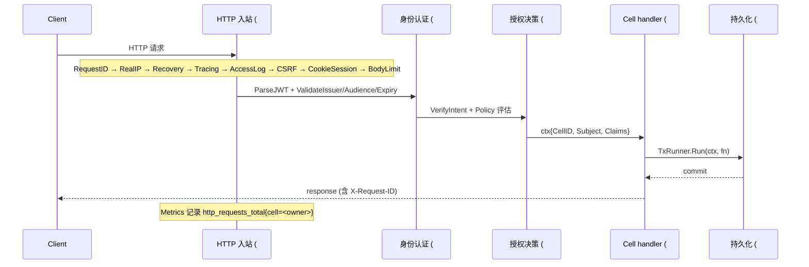
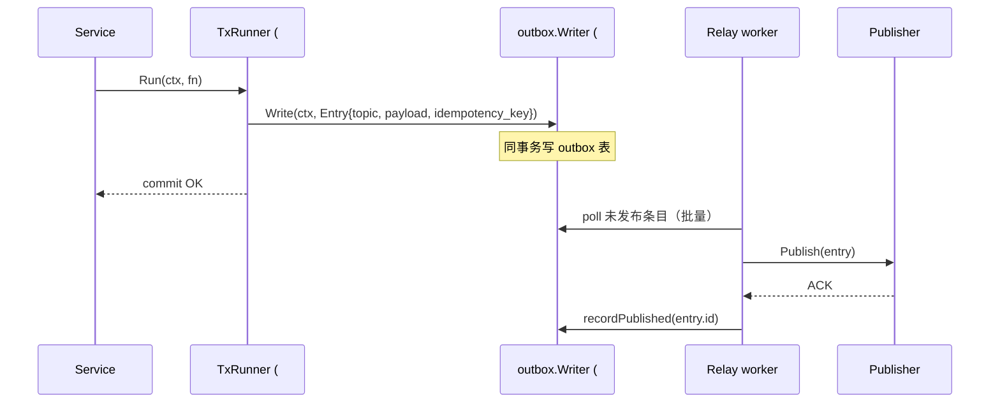
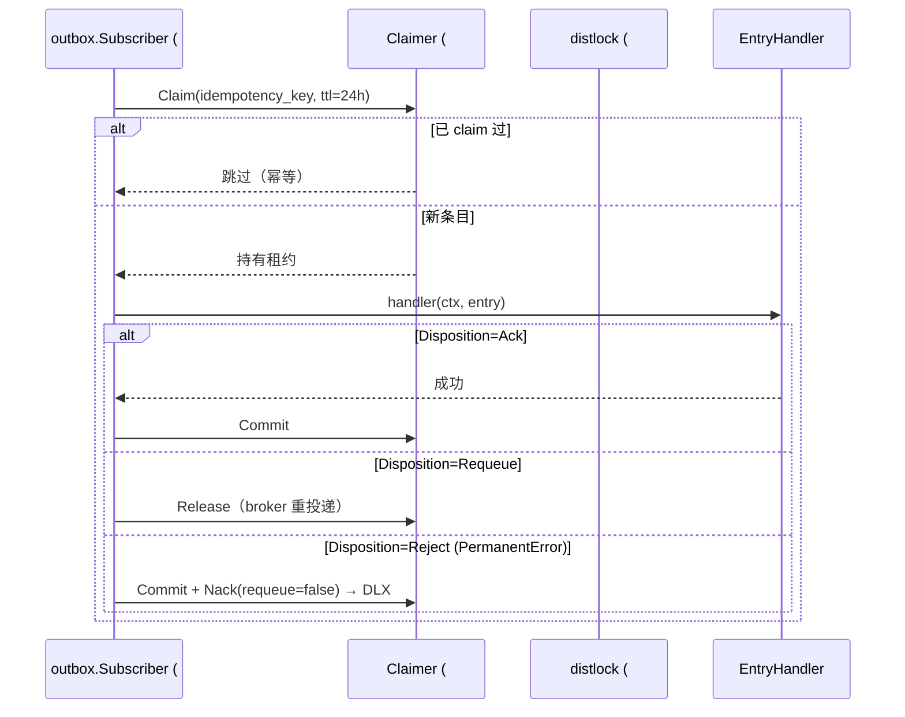
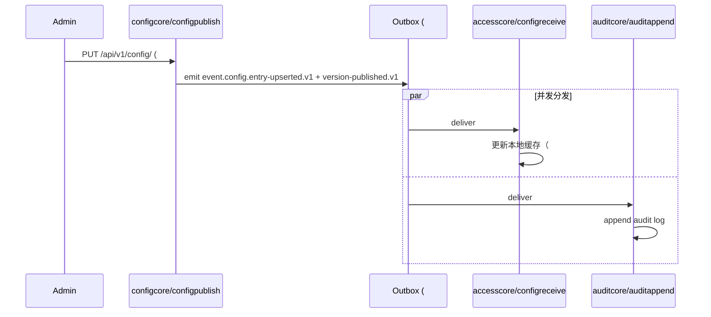
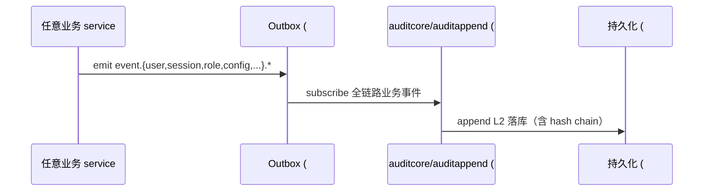
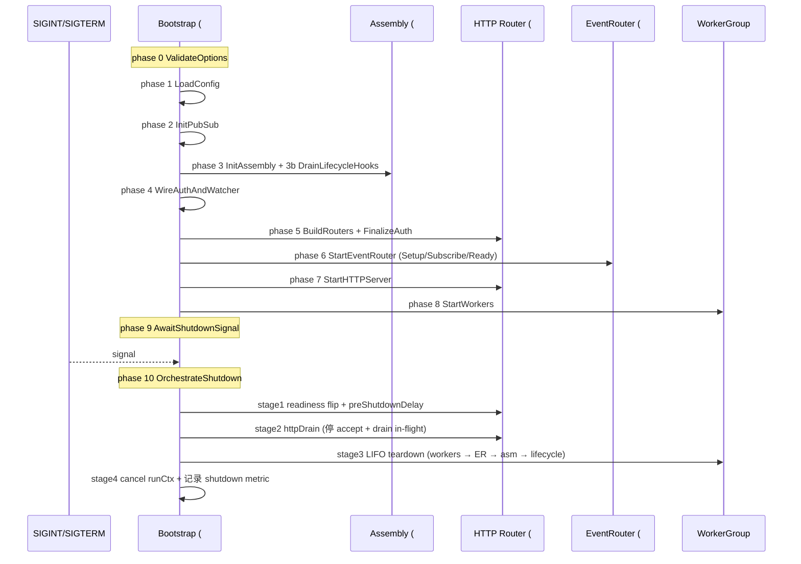

# GoCell 软件工程视角能力地图：包 → 能力 → 交互 → 业务功能 → 领域

| 项 | 值 |
|---|---|
| 评估日期 | 2026-05-04 |
| 基准 commit | `11600a4f`（develop） |
| 评估视角 | 在「包清单」之上重建 5 层抽象，回答「这些代码到底能为谁做什么」 |
| 前置文档 | `20260504-first-principles-capabilities-and-replaceable-deps.md`（L0 包级盘点） |
| 本文定位 | **事实地图**——不下设计建议、不评分、不补 finding |

---

## 0. 抽象层级与双重价值链

前置 first-principles 报告盘点了 102 个生产包，但停留在 L0：成分清单。本文沿能力组合方向继续推 4 层：

```
L0  包 (102 prod + 16 opt + 13 tools)        前置报告
 ↓  组合
L1  能力单元 Capability Unit                  本文 §1（14 项）
 ↓  协作
L2  能力交互模式 Interaction Pattern          本文 §2（6 模式）
 ↓  封装
L3  业务功能 Business Function                本文 §3（7 项）
 ↓  适用
L4  领域应用 Domain Application               本文 §4（基于 examples/）
```

**双重价值链**：GoCell 同时供给两条链，§1-§5 在两条上并行展开——

- **框架价值链**：`kernel/` + `runtime/` + `adapters/` 供框架使用者构造自己的 Cell（声明、跑生命周期、跨 Cell 通信）
- **平台价值链**：`cells/{accesscore,auditcore,configcore}` + `contracts/` 给框架使用者的最终用户提供开箱即用的身份 / 审计 / 配置能力

---

## 1. 能力单元（14 项）

每条目结构：能力名 + 公理对应 + 主要包组合 + 对外接口 / 契约。能力单元是「可独立交付价值的最小技术封装」——拆得更小就失去意义，合得更大就破坏关注点分离。

### 1.A 框架公理能力（7 项，对应 A1-A4）

| # | 能力 | 公理 | 包组合 | 对外接口 / 契约 |
|---|---|---|---|---|
| 1 | **Cell 声明与生命周期** | A1+A2 | `kernel/cell` + `assembly` + `lifecycle` + `worker` + `runtime/worker` | `cell.Cell` 接口、`cell.Slice`、`assembly.CoreAssembly.StartWithConfig` |
| 2 | **元数据解析与治理** | A1+A4 | `kernel/metadata` + `governance` + `verify` + `depgraph` + `tools/archtest`（158 条） + `tools/generatedverify` | YAML 解析（cell/slice/contract/journey/assembly）+ 6 系列治理规则（REF/TOPO/VERIFY/FMT/ADV/OUTGARD） |
| 3 | **Contract 注册与发现** | A3 | `kernel/wrapper` + `kernel/registry` + `pkg/contracts` | `wrapper.ContractSpec`（字面量）+ `registry.Registry.Subscribe(spec, handler, group)` |
| 4 | **HTTP 入站处理** | A2 | `runtime/http/{router,middleware,health,devtools}` + 19 middleware | `router.Router.MountRouteGroup` + `auth.Mount` + `RouteGroup.CellID`（owner 归属） |
| 7 | **事务性事件发布（Outbox Producer）** | A3 | `kernel/outbox` + `runtime/outbox` + `adapters/postgres` | `outbox.Writer.Write(ctx, Entry{Topic,Payload,IdempotencyKey})` 同事务原子写 |
| 8 | **异步事件消费（Subscriber + Claimer）** | A3 | `kernel/{outbox,idempotency}` + `runtime/eventrouter` + `adapters/{redis,rabbitmq}` | `outbox.Subscriber` + 两阶段 `Claim/Commit/Release` + `HandleResult.Disposition`（Ack/Requeue/Reject） |
| 12 | **启停编排（Bootstrap）** | A2 | `runtime/bootstrap` + `runtime/shutdown` | `bootstrap.Boot(ctx, opts)` 串 phase 0–10 + LIFO teardown + readiness flip |

### 1.B 支撑能力（7 项）

| # | 能力 | 包组合 | 对外接口 |
|---|---|---|---|
| 5 | **身份认证 (Authn)** | `runtime/auth` + `auth/refresh` + `auth/refresh/memstore` + `auth/config` | `JWTIssuer/Verifier`、`ServiceToken (HMAC+Nonce)`、`TokenIntent`（防 token confusion）、`Refresh` opaque selector.verifier |
| 6 | **授权决策 (Authz)** | `runtime/auth` (authz/policy) | Policy 评估、`AuthPlan`（AuthJWT/AuthServiceToken/AuthMTLS）、Public / PasswordResetExempt 豁免 |
| 9 | **配置加载与热更新** | `runtime/config` + watcher | `config.Load(path)`、`watcher.OnChange` 回调、env override |
| 10 | **持久化与加密** | `kernel/persistence` + `kernel/crypto` + `adapters/{postgres,vault}` | `persistence.TxRunner`、`crypto.KeyProvider/ValueTransformer`、pgx/v5 + goose 迁移 |
| 11 | **分布式锁** | `runtime/distlock` + `adapters/redis` | `distlock.Locker.Acquire(ctx, key, ttl) → Lock` |
| 13 | **可观测性** | `runtime/observability/{metrics,tracing,poolstats}` + `pkg/logutil` + `adapters/{prometheus,otel}` | `metrics.Provider`、`Tracer` 抽象、`http_requests_total{cell=...}`、`/healthz` + `/readyz` aggregator |
| 14 | **代码生成与治理工具链** | `tools/{archtest,codegen,depgraph,e2egate,metricschema,generatedverify}` + `cmd/gocell` 8 子命令 | `gocell {validate,scaffold,generate,check,verify,graph,export,dispatch}` + `cellgen` / `contractgen`（K#04/06）|

> 说明：能力 14 仅在编译期 / CI 期消费，不进生产二进制（runtime 不 link `tools/*`）。

---

## 2. 能力交互模式（6 个）

每个模式 = 一段「触发 → 涉及能力序列」的可观测链路。Mermaid 序列图的 actor 用能力单元名（不用包名）以聚焦关注点。

### 2.1 HTTP 同步请求-响应（涉及 #1 #4 #5 #6 #10 #13）



一致性等级：L0/L1（取决于 handler）。

### 2.2 事务性事件发布（涉及 #7 #10）



一致性等级：L2 OutboxFact。Service 构造期 `nil TxRunner` 必须 fail-fast（`OUTBOX-SERVICE-01` archtest 守护）。

### 2.3 异步事件消费（涉及 #8 #11）



一致性等级：L3 WorkflowEventual。Disposition 零值 = invalid，被安全降级为 Requeue（ADR-202605031900）。

### 2.4 配置广播（涉及 #4 #7 #8 #9）



订阅关系由 `slice.yaml.contractUsages[role=subscribe]` 与 `contract.yaml.endpoints.subscribers` 双向校验（ADV-06）。

### 2.5 审计旁路（涉及 #7 #8）



`auditcore` 是「观察者」角色——不发起业务，只追踪。完整性可由 `auditverify` slice 反向校验。

### 2.6 启停编排（涉及 #12，统领所有能力）



---

## 3. 业务功能（端到端，7 项）

「业务功能」= 框架使用者直接调用的端到端场景。每项注明入口 + 实现 slice + 涉及交互模式。

| 业务功能 | 入口 | 实现 slice | 一致性 | 涉及交互 |
|---|---|---|---|---|
| **用户身份与会话** | `POST /api/v1/access/sessions/login` `POST /api/v1/access/sessions/refresh` `DELETE /api/v1/access/sessions/{id}` `POST /api/v1/access/users/...` | accesscore: sessionlogin / sessionlogout / sessionrefresh / sessionvalidate / identitymanage / setup | L2 | 2.1 + 2.2 + 2.5 |
| **访问控制 (RBAC + Policy)** | 任何带 auth chain 的 path | accesscore: rbacassign / rbaccheck / authorizationdecide | L2 | 2.1 + 2.5 |
| **配置发布与生效** | `POST/GET/DELETE /api/v1/config/*` + `event.config.*` | configcore: configpublish / configwrite / configread / configsubscribe + accesscore/configreceive | L2 | 2.4 + 2.5 |
| **特性开关** | `GET /api/v1/flags/...` + admin 写 | configcore: featureflag / flagwrite | L1+L2 | 2.1 + 2.5 |
| **审计追踪** | `GET /api/v1/audit/entries` + 全链路 event 订阅 | auditcore: auditappend / auditquery / auditarchive / auditverify | L2 | 2.5 |
| **跨 Cell 一致性** | （隐式，不直接暴露端点） | 框架级 outbox + idempotency | L2/L3 | 2.2 + 2.3 |
| **部署与运维** | `bootstrap.Boot()` + `/healthz` + `/readyz` + `/metrics` | （框架级） | — | 2.6 |

> 7 项业务功能 = 6 项内容能力（accesscore 2 项 + configcore 2 项 + auditcore 1 项 + 跨 cell 1 项）+ 1 项运维能力。直接对应 v1 corebundle 平台对外承诺。

---

## 4. 领域映射（基于 examples/ 实际项目）

⚠️ 仅列 `examples/` 实际存在的目录与各 cell.yaml 中显式声明的等级。**不臆测领域**——下表凡未在代码中出现的领域不写入。

| 实际项目 (`examples/`) | 业务定位 | cell 一致性 | 用到的能力单元 | 用到的业务功能 | 不用 |
|---|---|---|---|---|---|
| **demo** | 单 cell 启停演示 | L1（demo） | 1, 2, 3, 4, 12 | 部署与运维 | 持久化 / outbox / 平台 cell |
| **iotdevice** | IoT 设备命令长延迟闭环 | **L4**（devicecell） | 1, 2, 3, 8, 11, 12 + L4 命令子模块（kernel/command） | 跨 cell 一致性 | RBAC / SSO / featureflag / 审计 |
| **todoorder** | 订单事件最终一致 | L2（ordercell） | 1, 2, 3, 4, 7, 10, 12 | 跨 cell 一致性（订单事件） | RBAC / 平台 cell |
| **ssobff** | SSO BFF 集成三大平台 cell | 复用 platform 全部 L2 | 1, 2, 3, 4, 5, 6, 7, 8, 12 | 用户身份与会话 + 访问控制 + 配置发布 + 审计追踪（全部 4 项） | L4 命令 / 分布式锁 |
| **v1 corebundle 平台** | 平台默认二进制 | 全 L2 | 全部 1–14 | 全部 7 项 | — |

**领域读法**：
- iotdevice 是 GoCell 现有代码中唯一触发 **L4 一致性等级**的领域（设备命令长延迟），需要 `kernel/command` 子模块（前置报告 §B 列为可选层）
- ssobff 不引入自定义 cell，纯靠**组装** v1 三大平台 cell + 自写 BFF 路由层——这是「平台价值链」的最直接消费样本
- todoorder 引入业务 cell（ordercell）但不引入身份/审计，演示「在框架上构造领域 Cell」的最小路径
- demo 不接 DB，仅展示生命周期，是「能力 1+12 最小化」的样本

---

## 5. 反向追溯：3 条事实

事实层观察，不下结论：

1. **任何 GoCell 应用最小集 = 能力 1+2+3+12**（公理 A1-A2 强制）。demo 项目证明：去掉持久化 / Outbox / Auth / 平台 cell 后程序仍可启停。
2. **能力 4–13 按需子集组合**：4 个 example 各取真子集，无人取全。这是「框架供给 ≥ 单领域需求」的工程证据，但也意味着 corebundle 默认二进制对单领域而言始终偏重——客户应基于 §4 表格选裁 assembly。
3. **能力 14（工具链）零生产成本**：archtest / codegen / depgraph 仅在编译期 + CI 期消费，不进 corebundle 二进制依赖图。这是「治理 ≠ 运行时开销」的可验证事实（goda list 反查 corebundle 不含 `tools/*`）。

---

## 与已有 review 的关系

| 已有 review | 关注层 | 本文关系 |
|---|---|---|
| first-principles-capabilities-and-replaceable-deps | L0 包 | **前置依赖**——本文 §1 的「包组合」列直接索引前置报告 §A.1-A.6 |
| systems-layer-01..08 + summary | L0 包 / L1 模块 | 互补——分层 review 走纵向（layer 内健康度），本文走横向（layer 间组合） |
| software-engineering-capabilities-review | L1 技术能力（16 原子） | **抽象级最近**——但前者只到「技术能力」（SRP/DRY 视角），本文把 L1 推到 L4 业务/领域 |
| kernel-group1/2/3 | L0 代码 finding | 不重叠——本文不复述 finding |
| systems-engineering-gap-assessment | 工程体系（V 模型/SysML） | 互补——前者诊断方法论缺口，本文供事实地图作为 SysML 块图的素材 |

---

> 报告结束。后续补充建议：当 cells/ 增加新平台 cell（如 PR#357 J1 后续可能引入的 J2/J3 cell）或 examples/ 新增领域示例，本文 §3-§4 须同步增量；§1 能力单元数量稳定，仅在公理变化时调整。
