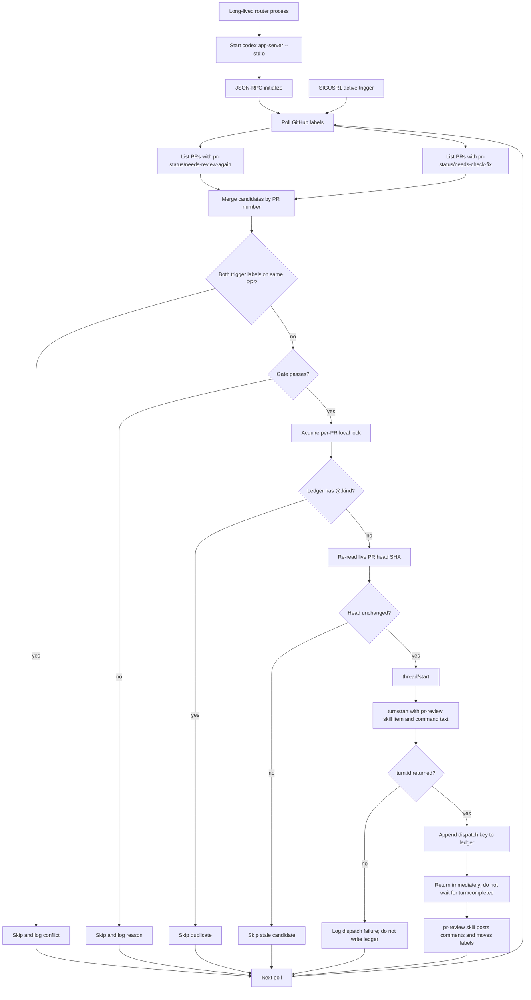
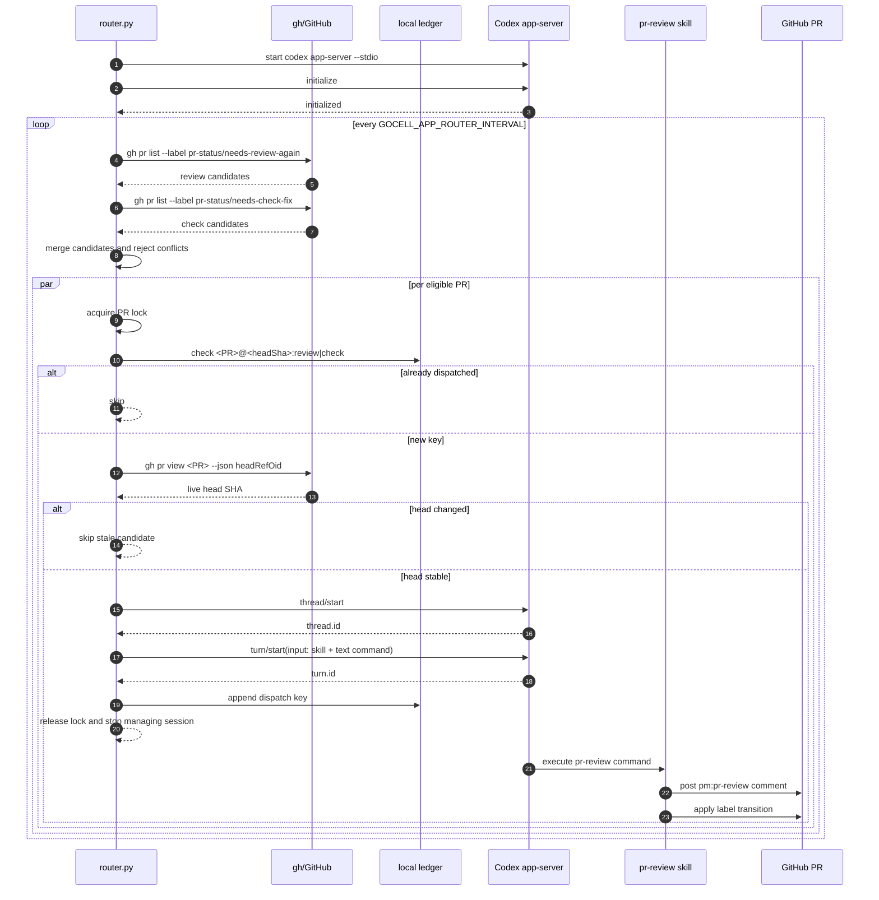
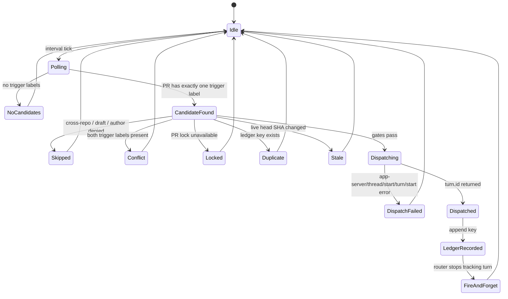
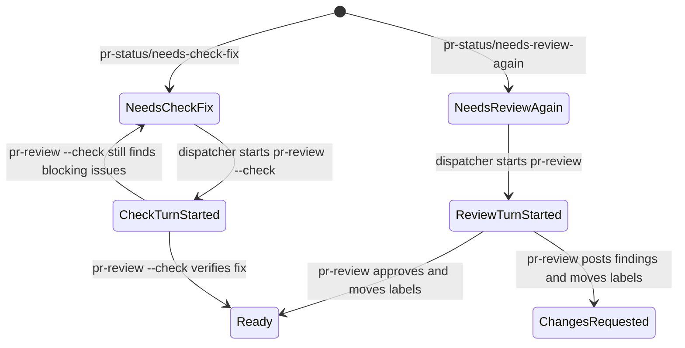
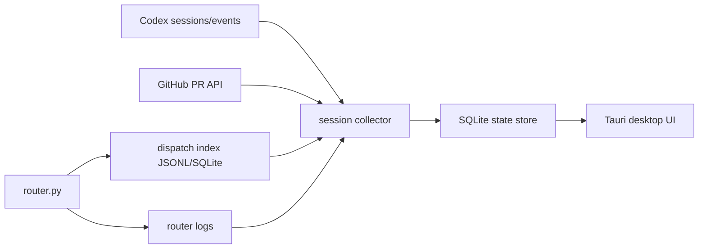
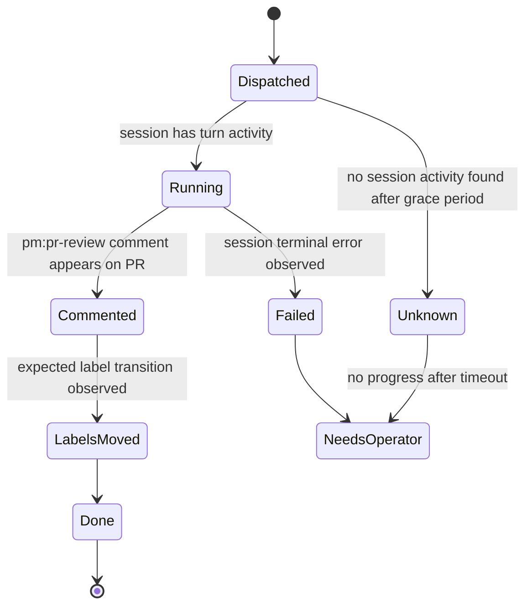

# Codex PR App Dispatcher

Fire-and-forget dispatcher for GoCell PR review labels.

This dispatcher watches GitHub PR labels and starts one Codex app-server turn per eligible PR. It does not manage the Codex session after `turn/start` succeeds. The project-local `pr-review` skill owns review execution, PR comments, machine blocks, and label transitions.

## Scope

In scope:

- Poll open PRs in `ghbvf/gocell`.
- Dispatch same-repo, non-draft, allowlisted PRs.
- Map labels to project skill commands:
  - `pr-status/needs-review-again` -> `pr-review <PR#>`
  - `pr-status/needs-check-fix` -> `pr-review <PR#> --check`
- Start Codex through `codex app-server --stdio`.
- Wait only for `thread/start` and `turn/start` JSON-RPC responses.
- Write a local dispatch ledger after `turn/start` returns a `turn.id`.

Out of scope:

- Waiting for `turn/completed`.
- Reading or summarizing Codex session output.
- Checking PR postconditions after review.
- Moving labels directly from the dispatcher.
- Retrying failed Codex work after the turn has already started.

## Runtime Model

Production should run the dispatcher as a long-lived process. One dispatcher process owns one long-lived `codex app-server --stdio` child. Each poll can dispatch multiple PRs in parallel through that app-server.

`--once` is for smoke tests and local debugging. When `--once` exits, it closes its app-server child, so any started turn depends on whether the app-server/session runtime has already taken ownership. Production should not depend on that timing.

Required environment:

```bash
export GOCELL_APP_ROUTER_AUTHORS="alice bot"
export GOCELL_APP_ROUTER_REPO_ROOT="/Users/shengming/Documents/code/gocell"
export GOCELL_APP_ROUTER_HOME="${HOME}/.local/gocell-pr-app-router"
export GOCELL_APP_ROUTER_INTERVAL=120
export GOCELL_APP_ROUTER_REPO="ghbvf/gocell"
export CODEX_BIN="codex"
export GH_BIN="gh"
```

Run:

```bash
python3 hack/automation/codex-pr-app-dispatcher/router.py
```

Dry run:

```bash
python3 hack/automation/codex-pr-app-dispatcher/router.py --dry-run --once
```

## Poll Interval

The router polls once immediately after startup, then sleeps for `GOCELL_APP_ROUTER_INTERVAL` seconds between polls.

Default:

```text
120
```

Recommended LaunchAgent value for normal operation:

```bash
export GOCELL_APP_ROUTER_INTERVAL=300
```

That means one GitHub PR information pull every 5 minutes. A normal empty poll performs two `gh pr list` calls, one for each trigger label. It performs extra `gh pr view` calls only for candidate PRs that pass initial discovery.

## Active Poll Trigger

The long-lived router supports an immediate poll without restarting app-server. Send `SIGUSR1` to the running router process:

From Codex, use the repository skill:

```text
codex-pr-dispatcher
```

From a shell, run:

```bash
bash hack/automation/codex-pr-app-dispatcher/trigger.sh
```

On macOS LaunchAgent installations this script runs:

```bash
launchctl kill SIGUSR1 gui/$(id -u)/com.ghbvf.gocell.codex-pr-app-dispatcher
```

The signal wakes the sleep loop, runs one normal `poll_once`, and then returns to the configured interval. It does not wait for Codex turns to complete and does not manage existing sessions.

## Flowchart



## Sequence



## State Machine

The dispatcher state machine is intentionally smaller than the review state machine. Once a turn has started, the dispatcher records dispatch and leaves completion to Codex plus `pr-review`.



PR labels move in the review-side workflow, not in this dispatcher:



## De-Dupe

Ledger path:

```text
$GOCELL_APP_ROUTER_HOME/state/dispatched
```

Ledger key:

```text
<PR>@<headSha>:review
<PR>@<headSha>:check
```

The key is written only after `turn/start` returns a `turn.id`. If the app-server request fails, no key is written and a later poll may retry.

If Codex starts successfully but fails later inside the turn, the dispatcher will not know. Recovery is manual:

1. Push a new commit to change the PR head SHA, or
2. Delete the specific ledger line and let the next poll dispatch again.

## Gates

Per candidate:

- Same-repo only.
- Draft PRs are skipped.
- Author must be in `GOCELL_APP_ROUTER_AUTHORS`.
- Same poll uses a per-PR lock.
- A PR with both trigger labels is skipped and logged as an error condition.
- Live head SHA is checked immediately before dispatch.

## App-Server Calls

The dispatcher uses JSON-RPC over stdio:

1. `initialize`
2. `thread/start`
3. `turn/start`

`turn/start.input` includes both:

- a skill item pointing at `.codex/skills/pr-review/SKILL.md`
- a text item requiring the exact project command:
  - `pr-review <PR#>`
  - `pr-review <PR#> --check`

`turn/start` must be a request with an `id`, not a notification. The dispatcher treats a missing `turn.id` as a dispatch failure and does not write the ledger.

## Monitoring Options

There are three levels of monitoring. They should be implemented outside the dispatcher so the dispatcher can remain fire-and-forget.

### Level 1: Current Operational Monitoring

Use this today:

- Router process status: LaunchAgent, system service, or process supervisor.
- Router logs:
  - `$GOCELL_APP_ROUTER_HOME/logs/router.log`
  - `$GOCELL_APP_ROUTER_HOME/logs/router.err.log`
- Dispatch ledger:
  - `$GOCELL_APP_ROUTER_HOME/state/dispatched`
- PR truth:
  - GitHub comments with `<!-- pm:pr-review -->`
  - PR labels such as `pr-status/ready`, `pr-review/approved`, `pr-review/changes-requested`
- Codex session files under `$CODEX_HOME/sessions/...` when local session inspection is needed.

This proves whether dispatch happened and whether the review-side skill changed the PR, but it is not a real-time progress UI.

### Level 2: Codex App Visibility

For real-time viewing inside Codex App, the cleanest approach is to make app-server-created threads visible/indexed in the app's normal thread list.

Required capabilities:

- Persist and expose `thread.id` and `turn.id` from each dispatch.
- Add a local index mapping:

```json
{
  "pr": 2121,
  "headSha": "6905af86afca004195fdb307b797b916bb652458",
  "kind": "check",
  "threadId": "...",
  "turnId": "...",
  "dispatchedAt": "2026-06-14T10:13:00Z"
}
```

- Provide a way for the operator to open that thread in Codex App.
- Subscribe to or read app-server/session events for progress display.

The dispatcher can write the index at dispatch time, but it still should not wait for completion or mutate PR labels.

### Level 3: Separate Tauri App

A Tauri app is useful only if Codex App cannot expose app-server threads directly or if the team wants a dedicated operations console.

Suggested architecture:



The Tauri app should be read-mostly:

- PR number, head SHA, kind, dispatch time.
- Thread and turn ids.
- Current inferred phase: queued, running, commented, labels-moved, failed, stale.
- Links to GitHub PR/comment and Codex session/thread.
- Manual actions:
  - delete one ledger key for redispatch
  - open PR
  - open local session file
  - copy thread/turn id

It should not own the review workflow. The source of truth remains GitHub PR labels/comments plus Codex session events.

## Monitoring State Model

If monitoring is added, use a separate monitor state machine:



This monitor may read sessions and GitHub, but it must not be merged into `router.py` unless the fire-and-forget contract is intentionally changed.

## Test

Offline selftest:

```bash
bash hack/automation/codex-pr-app-dispatcher/selftest.sh
```

Syntax check:

```bash
python3 -m py_compile hack/automation/codex-pr-app-dispatcher/router.py
```
